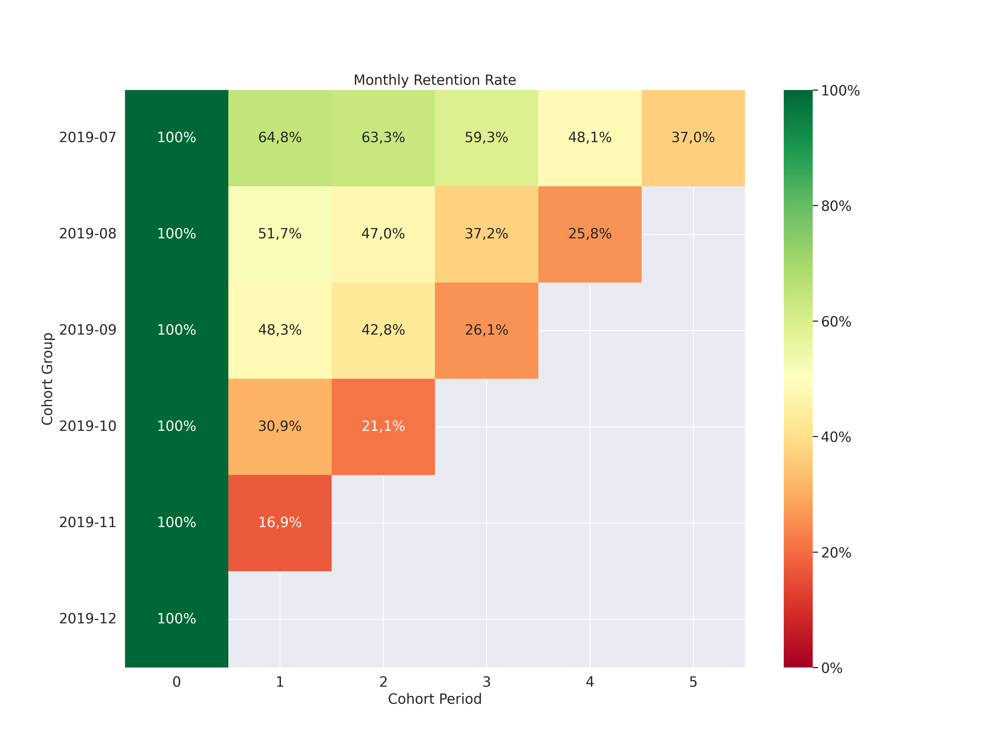

Analytic
========

grplot ships two standalone analytic functions in ``grplot.analytic``.

----

Cohort
------

Cohort retention analysis. Builds a monthly retention heatmap from a
DataFrame containing a customer ID, a signup date, and a last-active date.

**import:** ``from grplot.analytic import cohort``

.. rubric:: Plot-Specific Parameters

``customer_id`` *(str)*
   Name of the column that uniquely identifies each customer.

``signup_date`` *(str)*
   Name of the column holding the first order / signup date (must be
   parseable as datetime).

``last_active_date`` *(str)*
   Name of the column holding the most recent active date (must be
   parseable as datetime).

``display_summary`` *(bool, default: False)*
   If ``True``, display the intermediate cohort pivot table (cohort group ×
   cohort period) alongside the heatmap.

.. rubric:: Example

.. code-block:: python

   from grplot.analytic import cohort
   import grplot_seaborn as gs
   import pandas as pd

   gs.set_theme(context='notebook', style='darkgrid', palette='deep')

   df = pd.read_csv('https://github.com/ghiffaryr/grplot_data/raw/main/retail_raw_reduced.csv',
                    parse_dates=['order_date'])
   df['last_active_date'] = df.groupby('customer_id')['order_date'].transform('max')
   ax = cohort(df=df,
               customer_id='customer_id',
               signup_date='order_date',
               last_active_date='last_active_date',
               figsize=[16, 12],
               fontsize=16,
               sep='.',
               display_summary=True)

Rank Order, Gain, KS, and Lift
-------------------------------

Rank Order table for binary classification model evaluation. Splits
predictions into deciles (highest predicted non-event probability first)
and computes cumulative Gain, KS statistic, and Lift for each decile.

**import:** ``from grplot.analytic import rank_order``

.. rubric:: Parameters

``predict_proba`` *(numpy.ndarray or pandas.DataFrame)*
   Predicted class probabilities with shape ``(n_samples, n_classes)``.
   Each row must contain the probability for every class; at minimum two
   columns are required. Pass the full output of
   ``sklearn``'s ``predict_proba()`` directly.

``true_label`` *(list, numpy.ndarray, or pandas.Series)*
   Ground-truth binary labels with length ``n_samples``.

``class_non_event`` *(int, default: 1)*
   Column index (0-based) in ``predict_proba`` that corresponds to the
   **non-event** class. For a standard two-class model where index 1 is
   the positive/non-event class, use the default value of ``1``.

``display_table`` *(bool, default: True)*
   If ``True``, display the resulting rank order table in the notebook
   output before returning it.

.. rubric:: Example

.. code-block:: python

   from grplot.analytic import rank_order
   import numpy as np

   np.random.seed(0)
   predict_proba = np.array([np.random.uniform(low=0.1, high=1.0, size=10),  # class 0
                              np.random.uniform(low=0.1, high=1.0, size=10)])  # class 1
   predict_proba = np.swapaxes(predict_proba, 0, 1)
   true_label = np.random.randint(low=0, high=2, size=10)
   rank_order_table = rank_order(predict_proba=predict_proba,
                                 true_label=true_label,
                                 class_non_event=1)

.. csv-table::
   :header: "Decile","Minimum Prediction Probability","Maximum Prediction Probability","Mean Prediction Probability","Count Customer","Count Non-event","Count Event","Non-event Rate","Cummulative Count Customer","Cummulative Count Non-event","Cummulative Count Event","Cummulative Customer Percentage","Cummulative Non-event Percentage","Cummulative Event Percentage","KS","Lift"
   :widths: 4,20,20,20,8,10,8,10,10,10,10,20,20,20,6,6

   9,0.933037,0.933037,0.933037,1,1,0,100.0,1,1,0,10.0,14.29,0.00,14.29,1.43
   8,0.883011,0.883011,0.883011,1,1,0,100.0,2,2,0,20.0,28.57,0.00,28.57,1.43
   7,0.849358,0.849358,0.849358,1,1,0,100.0,3,3,0,30.0,42.86,0.00,42.86,1.43
   6,0.812553,0.812553,0.812553,1,0,1,0.0,4,3,1,40.0,42.86,33.33,9.53,1.07
   5,0.800341,0.800341,0.800341,1,0,1,0.0,5,3,2,50.0,42.86,66.67,-23.81,0.86
   4,0.611240,0.611240,0.611240,1,0,1,0.0,6,3,3,60.0,42.86,100.00,-57.14,0.71
   3,0.576005,0.576005,0.576005,1,1,0,100.0,7,4,3,70.0,57.14,100.00,-42.86,0.82
   2,0.178416,0.178416,0.178416,1,1,0,100.0,8,5,3,80.0,71.43,100.00,-28.57,0.89
   1,0.163932,0.163932,0.163932,1,1,0,100.0,9,6,3,90.0,85.71,100.00,-14.29,0.95
   0,0.118197,0.118197,0.118197,1,1,0,100.0,10,7,3,100.0,100.00,100.00,0.00,1.00
