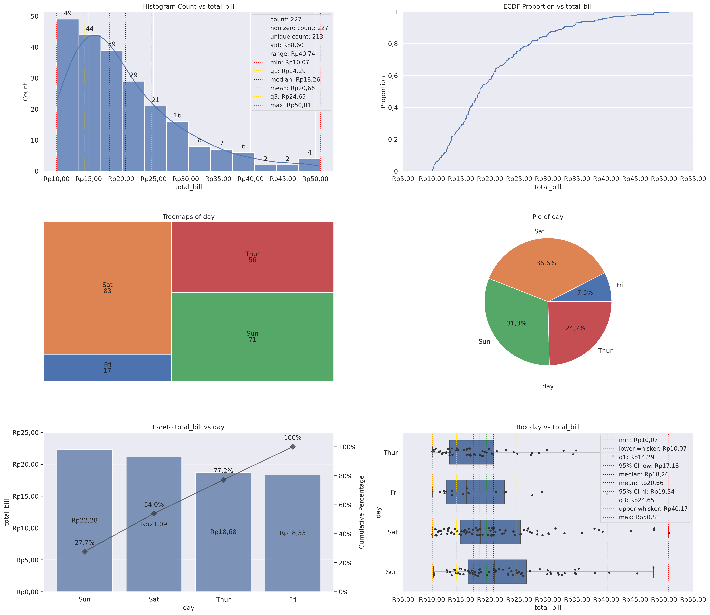
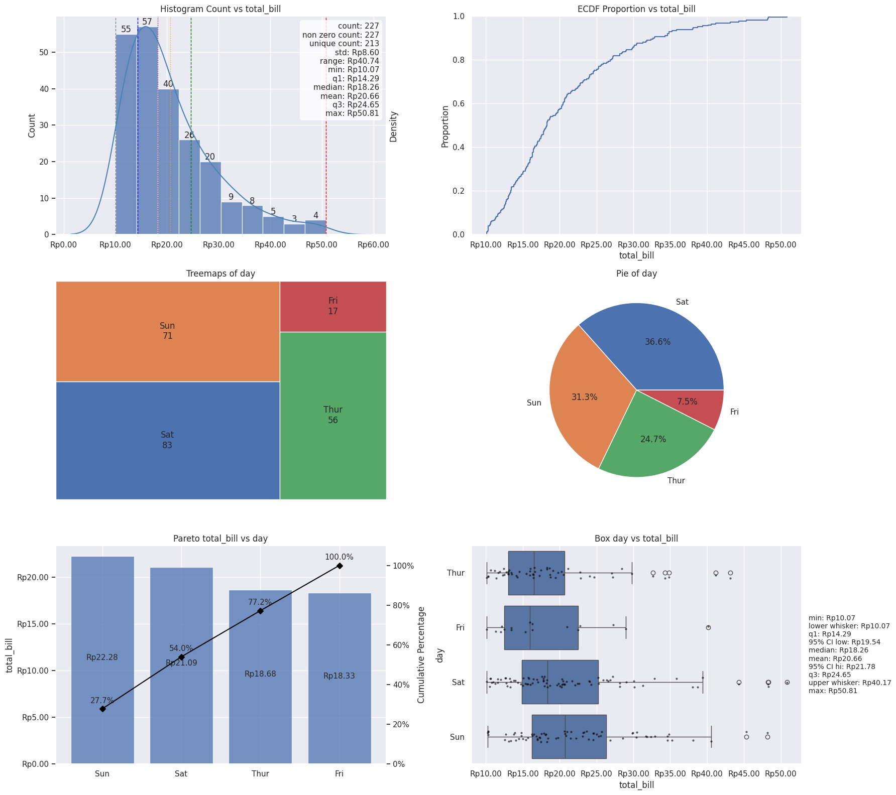

grplot vs. Matplotlib/Seaborn
=============================

Rather than assert that grplot reduces boilerplate, this page shows the same
dashboard implemented both ways so you can judge the difference directly.

Six-panel statistical dashboard
--------------------------------

The dashboard below combines six different chart families — a histogram
with KDE and summary statistics, an ECDF, a treemap, a pie chart, a Pareto
chart, and an annotated box + strip plot — each requiring its own
statistical-annotation logic (quantile lines and a stats box, a twin-axis
cumulative curve, confidence-interval whiskers).

Using grplot
~~~~~~~~~~~~

.. code-block:: python

   from grplot import plot2d
   import grplot_seaborn as gs

   gs.set_theme(context='notebook', style='darkgrid', palette='deep')

   tips = gs.load_dataset('tips')
   ax = plot2d(plot={'[1,1]': 'histplot', '[1,2]': 'ecdfplot',
                     '[2,1]': 'treemapsplot', '[2,2]': 'pieplot',
                     '[3,1]': 'paretoplot', '[3,2]': 'boxplot+stripplot'},
               Nx=2, Ny=3, df=tips, filter=(tips['total_bill'] > 10),
               figsize=[18, 16], fontsize=12, legend_fontsize=11,
               sep={'total_bill': '.c',
                    '.': ['Count', 'Proportion', '[2,1]', '[2,2]', 'Cumulative Percentage']},
               statdesc={'[1,1]': {'total_bill': 'general'},
                         '[3,2]': {'total_bill': 'boxplot'}},
               text={'Count': 'h', True: ['[2,1]', '[2,2]'], '[3,1]': {'total_bill': 'h+i'}},
               tick_add={'total_bill': 'Rp(_)'},
               title={'[1,1]': 'Histogram Count vs total_bill',
                      '[1,2]': 'ECDF Proportion vs total_bill',
                      '[2,1]': 'Treemaps of day',
                      '[2,2]': 'Pie of day',
                      '[3,1]': 'Pareto total_bill vs day',
                      '[3,2]': 'Box day vs total_bill'},
               alpha={'[1,1]': 0.75, '[3,1]': 0.75},
               kde=True)

**32 lines.**

Using Matplotlib/Seaborn
~~~~~~~~~~~~~~~~~~~~~~~~

.. code-block:: python

   import numpy as np
   import pandas as pd
   import matplotlib.pyplot as plt
   import matplotlib.ticker as mticker
   import seaborn as sns
   import squarify  # pip install squarify (for the treemap)

   sns.set_theme(context='notebook', style='darkgrid', palette='deep')
   tips = sns.load_dataset('tips')
   df = tips[tips['total_bill'] > 10].copy()
   fig, axes = plt.subplots(3, 2, figsize=(18, 16))
   rp = lambda v: f"Rp{v:,.2f}".replace(",", ".")

   # Histogram + KDE
   ax = axes[0, 0]
   tb = df['total_bill']
   counts, bins, patches = ax.hist(tb, bins=10, alpha=0.75, edgecolor='white')
   for c, left, right in zip(counts, bins[:-1], bins[1:]):
       if c > 0:
           ax.text((left + right) / 2, c + 0.5, f"{int(c)}", ha='center', fontsize=12)
   ax2 = ax.twinx()
   sns.kdeplot(tb, ax=ax2, color='steelblue')
   ax2.set_yticks([])
   stats = {
       'count': len(tb), 'non zero count': (tb != 0).sum(), 'unique count': tb.nunique(),
       'std': tb.std(), 'range': tb.max() - tb.min(), 'min': tb.min(),
       'q1': tb.quantile(0.25), 'median': tb.median(), 'mean': tb.mean(),
       'q3': tb.quantile(0.75), 'max': tb.max(),
   }
   for key in ['min', 'q1', 'median', 'mean', 'q3', 'max']:
       color = {'min': 'gray', 'q1': 'blue', 'median': 'purple',
                'mean': 'orange', 'q3': 'green', 'max': 'red'}[key]
       ls = '--' if key not in ('median', 'mean') else ':'
       ax.axvline(stats[key], color=color, linestyle=ls, linewidth=1)
   txt = "\n".join(
       [f"count: {stats['count']}", f"non zero count: {stats['non zero count']}",
        f"unique count: {stats['unique count']}", f"std: {rp(stats['std'])}",
        f"range: {rp(stats['range'])}"] +
       [f"{k}: {rp(stats[k])}" for k in ['min', 'q1', 'median', 'mean', 'q3', 'max']]
   )
   ax.text(0.98, 0.97, txt, transform=ax.transAxes, fontsize=11,
           va='top', ha='right', bbox=dict(boxstyle='round', facecolor='white', alpha=0.8))
   ax.xaxis.set_major_formatter(mticker.FuncFormatter(lambda v, _: rp(v)))
   ax.set_title('Histogram Count vs total_bill')
   ax.set_ylabel('Count')

   # ECDF
   ax = axes[0, 1]
   sns.ecdfplot(tb, ax=ax)
   ax.xaxis.set_major_formatter(mticker.FuncFormatter(lambda v, _: rp(v)))
   ax.set_title('ECDF Proportion vs total_bill')
   ax.set_ylabel('Proportion')

   # Treemap
   ax = axes[1, 0]
   day_counts = df['day'].value_counts()
   colors = sns.color_palette('deep', len(day_counts))
   squarify.plot(sizes=day_counts.values,
                 label=[f"{d}\n{c}" for d, c in day_counts.items()],
                 color=colors, ax=ax, edgecolor='white')
   ax.set_title('Treemaps of day')
   ax.axis('off')

   # Pie
   ax = axes[1, 1]
   day_counts_pie = df['day'].value_counts()
   ax.pie(day_counts_pie.values, labels=day_counts_pie.index,
          autopct='%1.1f%%', colors=sns.color_palette('deep'))
   ax.set_title('Pie of day')

   # Pareto
   ax = axes[2, 0]
   means = df.groupby('day', observed=True)['total_bill'].mean().sort_values(ascending=False)
   cum_pct = means.cumsum() / means.sum() * 100
   ax.bar(means.index, means.values, alpha=0.75)
   for i, v in enumerate(means.values):
       ax.text(i, v / 2, rp(v), ha='center', fontsize=11)
   ax.yaxis.set_major_formatter(mticker.FuncFormatter(lambda v, _: rp(v)))
   ax.set_ylabel('total_bill')
   ax3 = ax.twinx()
   ax3.plot(means.index, cum_pct.values, color='black', marker='D')
   for i, v in enumerate(cum_pct.values):
       ax3.text(i, v + 3, f"{v:.1f}%", ha='center', fontsize=11)
   ax3.set_ylim(0, 110)
   ax3.yaxis.set_major_formatter(mticker.PercentFormatter())
   ax3.set_ylabel('Cumulative Percentage')
   ax3.grid(False)
   ax.set_title('Pareto total_bill vs day')

   # Box + strip
   ax = axes[2, 1]
   order = ['Thur', 'Fri', 'Sat', 'Sun']
   sns.boxplot(data=df, x='total_bill', y='day', order=order, ax=ax, orient='h')
   sns.stripplot(data=df, x='total_bill', y='day', order=order, ax=ax,
                 color='black', size=3, alpha=0.6)
   ax.xaxis.set_major_formatter(mticker.FuncFormatter(lambda v, _: rp(v)))
   ax.set_title('Box day vs total_bill')
   q1, q3 = tb.quantile(0.25), tb.quantile(0.75)
   iqr = q3 - q1
   lw = tb[tb >= q1 - 1.5 * iqr].min()
   uw = tb[tb <= q3 + 1.5 * iqr].max()
   se = tb.std() / np.sqrt(len(tb))
   box_stats = {
       'min': tb.min(), 'lower whisker': lw, 'q1': q1,
       '95% CI low': tb.mean() - 1.96 * se, 'median': tb.median(),
       'mean': tb.mean(), '95% CI hi': tb.mean() + 1.96 * se,
       'q3': q3, 'upper whisker': uw, 'max': tb.max(),
   }
   txt = "\n".join(f"{k}: {rp(v)}" for k, v in box_stats.items())
   ax.text(1.02, 0.5, txt, transform=ax.transAxes, fontsize=10,
           va='center', ha='left', bbox=dict(boxstyle='round', facecolor='white', alpha=0.8))

   plt.tight_layout()
   plt.savefig('dashboard.png', dpi=100, bbox_inches='tight')

**101 lines** — roughly 3x longer, because each panel's statistical
annotation (the stats box, the twin-axis cumulative line, the confidence
interval) is written out by hand instead of being generated from a
declarative argument.

Where the difference disappears
--------------------------------

This advantage is not universal, and it would be misleading to imply
otherwise. For a grid of *one repeated chart type* — nine box plots across a
metric/cluster grid, for example — grplot (37 lines) and a short Matplotlib
loop (34 lines) come out roughly the same length. grplot's boilerplate
reduction is concentrated in dashboards that mix several chart families, each
needing its own statistical-annotation code; it offers no particular
advantage when a simple loop over one chart type already does the job.

.. list-table::
   :header-rows: 1
   :widths: 60 15 20 15

   * - Dashboard
     - grplot
     - Matplotlib/Seaborn
     - Ratio
   * - 6 heterogeneous panels (as above)
     - 32 lines
     - 101 lines
     - 3.2×
   * - 9 homogeneous panels (boxplot only, repeated across a metric/cluster grid)
     - 37 lines
     - 34 lines
     - ~1.0×

In both cases, ``plot2d`` returns the underlying Matplotlib ``Axes`` array,
so any further per-panel customization is still available through the normal
Matplotlib API on top of the generated baseline.
