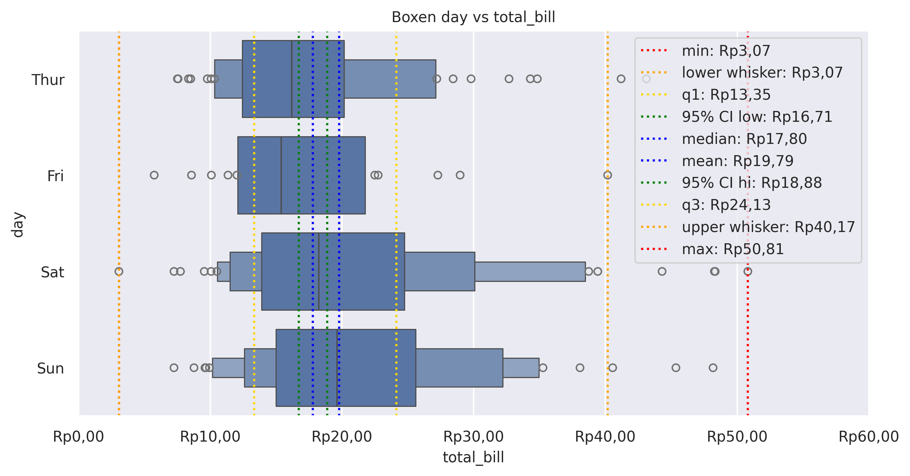

Boxen Plot
==========

Draw an enhanced box plot for larger datasets.

**plot:** ``'boxenplot'``

.. rubric:: Plot-Specific Parameters

``hue`` *(str, list, numpy.ndarray, pandas.core.indexes.base.Index, or None, default: None)*
   Semantic variable that is mapped to determine the color of plot elements.

``order`` *(list or None, default: None)*
   Order to plot the categorical levels in, otherwise the levels are inferred from the data objects.

``hue_order`` *(list or None, default: None)*
   Specify the order of processing and plotting for categorical levels of the hue semantic.

``orient`` *(str or None, default: None)*
   Orientation of the plot (vertical or horizontal). This is usually inferred based on the type of the input variables, but it can be used to resolve ambiguity when both x and y are numeric or when plotting wide-form data.

``color`` *(matplotlib.colors or None, default: None)*
   Color for all of the elements, or seed for a gradient palette.

``palette`` *(str, list, matplotlib.colors.Colormap, or None, default: None)*
   Method for choosing the colors to use when mapping the hue semantic. String values are passed to color_palette(). List values imply categorical mapping, while a colormap object implies numeric mapping.

``saturation`` *(float, default: 0.75)*
   Proportion of the original saturation to draw colors at. Large patches often look better with slightly desaturated colors, but set this to 1 if you want the plot colors to perfectly match the input color spec.

``fill`` *(bool, default: True)*
   If True, use a solid patch. Otherwise, draw as line art.

``dodge`` *(str or bool, default: 'auto')*
   When hue mapping is used, whether elements should be narrowed and shifted along the orient axis to eliminate overlap. If "auto", set to True when the orient variable is crossed with the categorical variable or False otherwise.

``width`` *(float, default: 0.8)*
   Width allotted to each element on the orient axis. When native_scale=True, it is relative to the minimum distance between two values in the native scale.

``gap`` *(float, default: 0)*
   Shrink on the orient axis by this factor to add a gap between dodged elements.

``linewidth`` *(float or None, default: None)*
   Width of the gray lines that frame the plot elements.

``linecolor`` *(matplotlib.colors or None, default: None)*
   Color to use for line elements, when fill is True.

``width_method`` *(str, default: 'exponential')*
   Method to use for the width of the letter value boxes: - "exponential": Represent the corresponding percentile - "linear": Decrease by a constant amount for each box - "area": Represent the density of data points in that box

``k_depth`` *(str or int, default: 'tukey')*
   The number of levels to compute and draw in each tail: - "tukey": Use log2(n) - 3 levels, covering similar range as boxplot whiskers - "proportion": Leave approximately outlier_prop fliers - "trusthworthy": Extend to level with confidence of at least trust_alpha - "full": Use log2(n) + 1 levels and extend to most extreme points

``outlier_prop`` *(float, default: 0.007)*
   Proportion of data expected to be outliers; used when k_depth="proportion".

``trust_alpha`` *(float, default: 0.05)*
   Confidence threshold for most extreme level; used when k_depth="trustworthy".

``showfliers`` *(bool, default: True)*
   If False, suppress the plotting of outliers.

``hue_norm`` *(tuple, matplotlib.colors.Normalize, or None, default: None)*
   Normalization in data units for colormap applied to the hue variable when it is numeric. Not relevant if hue is categorical.

``native_scale`` *(bool, default: False)*
   When True, numeric or datetime values on the categorical axis will maintain their original scaling rather than being converted to fixed indices.

``formatter`` *(callable or None, default: None)*
   Function for converting categorical data into strings. Affects both grouping and tick labels.

``legend`` *('auto', 'brief', 'full', or False, default: 'auto')*
   How to draw the legend. If "brief", numeric hue and size variables will be represented with a sample of evenly spaced values. If "full", every group will get an entry in the legend. If "auto", choose between brief or full representation based on number of levels. If False, no legend data is added and no legend is drawn.

``box_kws`` *(dict or None, default: None)*
   Keyword arguments for the box artists; passed to matplotlib.patches.Rectangle.

``line_kws`` *(dict or None, default: None)*
   Keyword arguments for the line denoting the median; passed to matplotlib.axes.Axes.plot().

``flier_kws`` *(dict or None, default: None)*
   Keyword arguments for the scatter denoting the outlier observations; passed to matplotlib.axes.Axes.scatter().

``zorder`` *(int or None, default: None)*
   Axes order. The default drawing order for axes is patches, lines, text for each plot order.

.. code-block:: python

   from grplot import plot2d
   import grplot_seaborn as gs
   gs.set_theme(context='notebook', style='darkgrid', palette='deep')

   tips = gs.load_dataset('tips')
   ax = plot2d(plot='boxenplot',
               df=tips,
               x='total_bill',
               y='day',
               figsize=[10, 6],
               sep='.c',
               xstatdesc='boxplot',
               xtick_add='Rp(_)',
               title='Boxen day vs total_bill')

