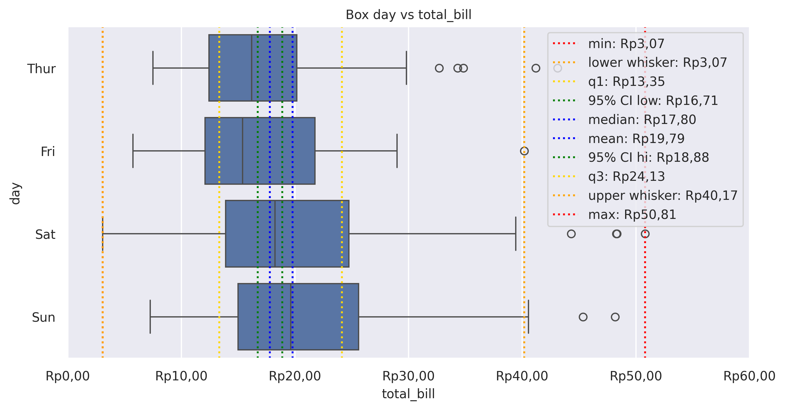
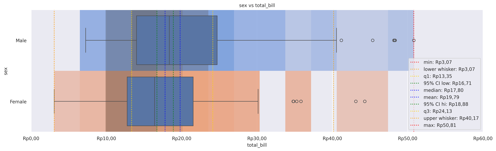

Box Plot
========

Draw a box plot to show distributions with respect to categories.

**plot:** ``'boxplot'``

.. rubric:: Plot-Specific Parameters

``hue`` *(str, list, numpy.ndarray, pandas.core.indexes.base.Index, or None, default: None)*
   Semantic variable that is mapped to determine the color of plot elements.

``order`` *(list or None, default: None)*
   Order to plot the categorical levels in, otherwise the levels are inferred from the data objects.

``hue_order`` *(list or None, default: None)*
   Specify the order of processing and plotting for categorical levels of the hue semantic.

``orient`` *(str or None, default: None)*
   Orientation of the plot (vertical or horizontal). This is usually inferred based on the type of the input variables, but it can be used to resolve ambiguity when both x and y are numeric or when plotting wide-form data.

``color`` *(matplotlib.colors or None, default: None)*
   Color for all of the elements, or seed for a gradient palette.

``palette`` *(str, list, matplotlib.colors.Colormap, or None, default: None)*
   Method for choosing the colors to use when mapping the hue semantic. String values are passed to color_palette(). List values imply categorical mapping, while a colormap object implies numeric mapping.

``saturation`` *(float, default: 0.75)*
   Proportion of the original saturation to draw colors at. Large patches often look better with slightly desaturated colors, but set this to 1 if you want the plot colors to perfectly match the input color spec.

``fill`` *(bool, default: True)*
   If True, use a solid patch. Otherwise, draw as line art.

``dodge`` *('auto', or bool, default: 'auto')*
   When hue mapping is used, whether elements should be narrowed and shifted along the orient axis to eliminate overlap. If "auto", set to True when the orient variable is crossed with the categorical variable or False otherwise.

``width`` *(float, default: 0.8)*
   Width allotted to each element on the orient axis. When native_scale=True, it is relative to the minimum distance between two values in the native scale.

``gap`` *(float, default: 0)*
   Shrink on the orient axis by this factor to add a gap between dodged elements.

``whis`` *(float, default: 1.5)*
   Proportion of the IQR past the low and high quartiles to extend the plot whiskers. Points outside this range will be identified as outliers.

``linecolor`` *(str or matplotlib.colors, default: 'auto')*
   Proportion of the IQR past the low and high quartiles to extend the plot whiskers. Points outside this range will be identified as outliers.

``linewidth`` *(float or None, default: None)*
   Width of the gray lines that frame the plot elements.

``fliersize`` *(float, default: 5)*
   Size of the markers used to indicate outlier observations.

``hue_norm`` *(tuple, matplotlib.colors.Normalize, or None, default: None)*
   Normalization in data units for colormap applied to the hue variable when it is numeric. Not relevant if hue is categorical.

``native_scale`` *(bool, default: False)*
   When True, numeric or datetime values on the categorical axis will maintain their original scaling rather than being converted to fixed indices.

``formatter`` *(callable or None, default: None)*
   Function for converting categorical data into strings. Affects both grouping and tick labels.

``legend`` *('auto', 'brief', 'full', or False, default: 'auto')*
   How to draw the legend. If "brief", numeric hue and size variables will be represented with a sample of evenly spaced values. If "full", every group will get an entry in the legend. If "auto", choose between brief or full representation based on number of levels. If False, no legend data is added and no legend is drawn.

``showmeans`` *(bool, default: False)*
   Show the arithmetic means.

``meanprops`` *(dict, default: {'marker':'s', 'markerfacecolor':'white', 'markeredgecolor':'.3'})*
   'markerfacecolor':'white', 'markeredgecolor':'.3'} The style of the mean.

``zorder`` *(int or None, default: None)*
   Axes order. The default drawing order for axes is patches, lines, text for each plot order.

.. rubric:: Example 1

.. code-block:: python

   from grplot import plot2d
   import grplot_seaborn as gs
   gs.set_theme(context='notebook', style='darkgrid', palette='deep')

   tips = gs.load_dataset('tips')
   ax = plot2d(plot='boxplot',
               df=tips,
               x='total_bill',
               y='day',
               figsize=[10, 6],
               sep='.c',
               xstatdesc='boxplot',
               xtick_add='Rp(_)',
               title='Box day vs total_bill')

.. rubric:: Example 2

.. code-block:: python

   from grplot import plot2d
   import grplot_seaborn as gs
   gs.set_theme(context='notebook', style='darkgrid', palette='deep')

   tips = gs.load_dataset('tips')
   ax = plot2d(plot='histplot+boxplot', 
               df=tips, 
               x='total_bill', 
               y='sex', 
               figsize=[16,6],
               sep='.c', 
               tick_add={'total_bill':'Rp(_)'},
               hue={'histplot':'sex'},
               xstatdesc='boxplot',
               legend_loc='lower right',
               title='sex vs total_bill',
               alpha={'histplot':0.75})

