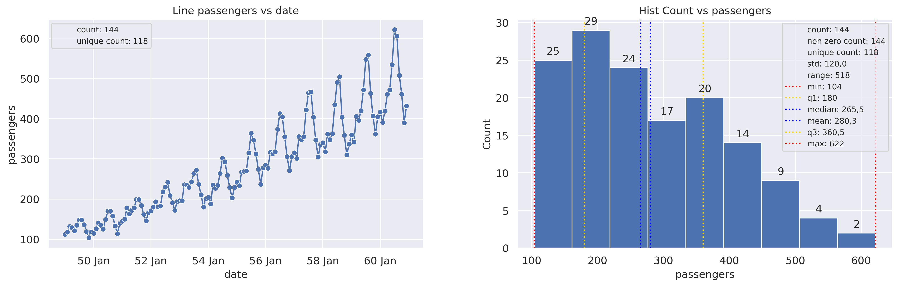

Dashboard-Like
==============

Combine multiple plot types and subplots in a single ``plot2d`` call.
Plot types are layered within a subplot using ``+``.

1 Dimensional
~~~~~~~~~~~~~

A 1-row, 2-column dashboard using the ``flights`` dataset. Subplot addresses
use ``'[i]'`` notation (single-row figures).

.. code-block:: python

   from grplot import plot2d
   import grplot_seaborn as gs
   import pandas as pd

   gs.set_theme(context='notebook', style='darkgrid', palette='deep')

   flights = gs.load_dataset('flights')
   flights['month'] = flights['month'].cat.codes + 1
   flights['date'] = pd.to_datetime(flights[['year', 'month']].assign(DAY=1))
   flights = flights.drop(labels=['year', 'month'], axis=1)
   ax = plot2d(plot={'[1]': 'lineplot+scatterplot', '[2]': 'histplot'},
               Nx=2,
               Ny=1,
               df=flights,
               x=['date', 'passengers'],
               y=['passengers', None],
               figsize=[16, 6],
               fontsize=12,
               legend_fontsize=9,
               sep={'passengers': '.', 'year': None},
               xdt={'[1]': '%y %b'},
               ytext={'[2]': 'h'},
               statdesc={'[1]': {'passengers': 'count+unique'},
                         '[2]': {'passengers': 'general'}},
               title={'[1]': 'Line passengers vs date',
                      '[2]': 'Hist Count vs passengers'})

2 Dimensional
~~~~~~~~~~~~~

A 2-column, 3-row dashboard using the ``tips`` dataset. Subplot addresses
use ``'[i,j]'`` notation.

.. code-block:: python

   from grplot import plot2d
   import grplot_seaborn as gs

   gs.set_theme(context='notebook', style='darkgrid', palette='deep')

   tips = gs.load_dataset('tips')
   ax = plot2d(plot={'[1,1]': 'histplot',
                     '[1,2]': 'ecdfplot',
                     '[2,1]': 'treemapsplot',
                     '[2,2]': 'pieplot',
                     '[3,1]': 'paretoplot',
                     '[3,2]': 'boxplot+stripplot'},
               Nx=2,
               Ny=3,
               df=tips,
               filter=(tips['total_bill'] > 10),
               x=['total_bill', 'total_bill', 'day', 'day', 'day', 'total_bill'],
               y=[None, None, None, None, 'total_bill', 'day'],
               hpad=6,
               wpad=8,
               figsize=[18, 16],
               fontsize=12,
               legend_fontsize=11,
               sep={'total_bill': '.c',
                    '.': ['Count', 'Proportion', '[2,1]', '[2,2]', 'Cumulative Percentage']},
               statdesc={'[1,1]': {'total_bill': 'general'},
                         '[3,2]': {'total_bill': 'boxplot'}},
               text={'Count': 'h', True: ['[2,1]', '[2,2]'], '[3,1]': {'total_bill': 'h+i'}},
               tick_add={'total_bill': 'Rp(_)'},
               title={'[1,1]': 'Histogram Count vs total_bill',
                      '[1,2]': 'ECDF Proportion vs total_bill',
                      '[2,1]': 'Treemaps of day',
                      '[2,2]': 'Pie of day',
                      '[3,1]': 'Pareto total_bill vs day',
                      '[3,2]': 'Box day vs total_bill'},
               alpha={'[1,1]': 0.75, '[3,1]': 0.75},
               alpha2={'[3,1]': 0.75},
               kde=True)

.. image:: ../_static/plots/dashboard_2d.png
   :alt: 2D dashboard with 6 plot types in a 2x3 grid
   :align: center
