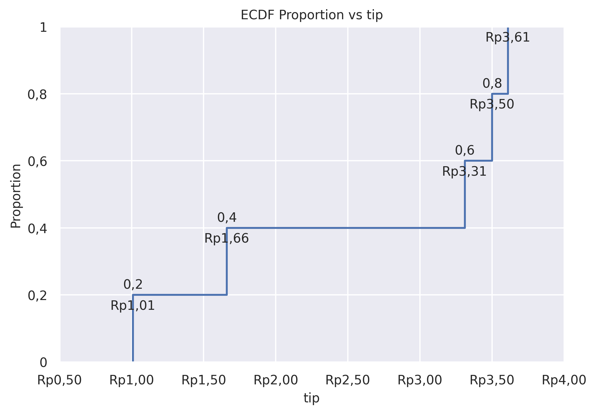

ECDF Plot
=========

Plot empirical cumulative distribution functions.

**plot:** ``'ecdfplot'``

.. rubric:: Plot-Specific Parameters

``hue`` *(str, list, numpy.ndarray, pandas.core.indexes.base.Index, or None, default: None)*
   Semantic variable that is mapped to determine the color of plot elements.

``weights`` *(str, list, numpy.ndarray, pandas.core.indexes.base.Index, or None, default: None)*
   If provided, weight the contribution of the corresponding data points towards the cumulative distribution using these values.

``stat`` *(str, default: 'proportion')*
   Distribution statistic to compute.

``complementary`` *(bool, default: False)*
   If True, use the complementary CDF (1 - CDF).

``palette`` *(str, list, matplotlib.colors.Colormap, or None, default: None)*
   Method for choosing the colors to use when mapping the hue semantic. String values are passed to color_palette(). List values imply categorical mapping, while a colormap object implies numeric mapping.

``hue_order`` *(list or None, default: None)*
   Specify the order of processing and plotting for categorical levels of the hue semantic.

``hue_norm`` *(tuple, matplotlib.colors.Normalize, or None, default: None)*
   Either a pair of values that set the normalization range in data units or an object that will map from data units into a 0 until 1 interval. Usage implies numeric mapping.

``alpha`` *(float or None, default: None)*
   Proportional opacity of the points.

``legend`` *(bool, default: True)*
   If False, suppress the legend for semantic variables.

``zorder`` *(int or None, default: None)*
   Axes order. The default drawing order for axes is patches, lines, text for each plot order.

.. code-block:: python

   from grplot import plot2d
   import grplot_seaborn as gs
   gs.set_theme(context='notebook', style='darkgrid', palette='deep')

   tips = gs.load_dataset('tips')
   ax = plot2d(plot='ecdfplot',
               df=tips.head(5),
               x='tip',
               xsep='.c',
               ysep='.',
               xtick_add='Rp(_)',
               text=True,
               title='ECDF Proportion vs tip')

