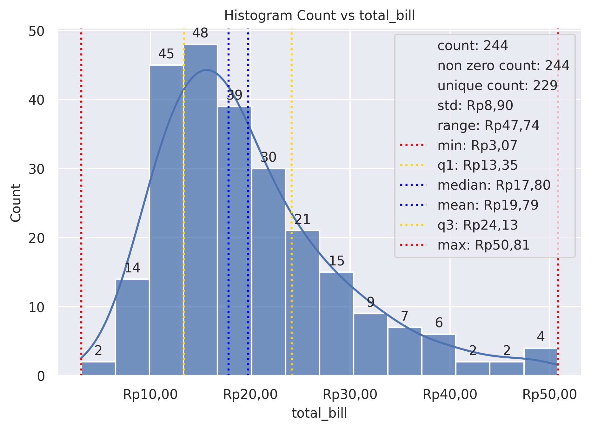
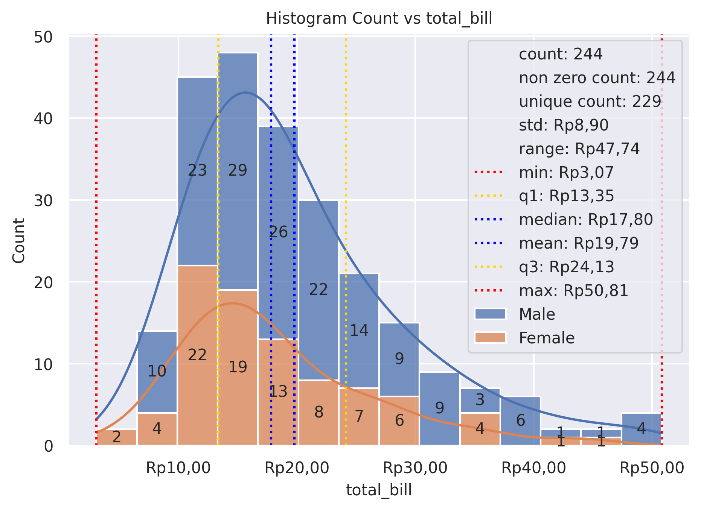

Hist Plot
=========

Plot univariate or bivariate histograms to show distributions of datasets.

**plot:** ``'histplot'``

.. rubric:: Plot-Specific Parameters

``hue`` *(str, list, numpy.ndarray, pandas.core.indexes.base.Index, or None, default: None)*
   Semantic variable that is mapped to determine the color of plot elements.

``weights`` *(str, list, numpy.ndarray, pandas.core.indexes.base.Index, or None, default: None)*
   If provided, weight the contribution of the corresponding data points towards the count in each bin by these factors.

``stat`` *(str, default: 'count')*
   Aggregate statistic to compute in each bin. - 'count', to show the number of observations in each bin. - 'frequency', to show the number of observations divided by the bin width. - 'probability' or 'proportion', to normalize such that bar heights sum to 1. - 'percent', to normalize such that bar heights sum to 100. - 'density', to normalize such that the total area of the histogram equals 1.

``bins`` *(str, float, or list, default: 'auto')*
   Generic bin parameter that can be the name of a reference rule, the number of bins, or the breaks of the bins. Passed to numpy.histogram_bin_edges().

``binwidth`` *(float, pair of float, or None, default: None)*
   Width of each bin, overrides bins but can be used with binrange.

``binrange`` *(pair of float, a pair of pairs, or None, default: None)*
   Lowest and highest value for bin edges; can be used either with bins or binwidth. Defaults to data extremes.

``discrete`` *(bool or None, default: None)*
   If True, default to binwidth=1 and draw the bars so that they are centered on their corresponding data points. This avoids 'gaps' that may otherwise appear when using discrete (integer) data.

``cumulative`` *(bool, default: False)*
   If True, plot the cumulative counts as bins increase.

``common_bins`` *(bool, default: True)*
   If True, use the same bins when semantic variables produce multiple plots. If using a reference rule to determine the bins, it will be computed with the full dataset.

``common_norm`` *(bool, default: True)*
   If True and using a normalized statistic, the normalization will apply over the full dataset. Otherwise, normalize each histogram independently.

``multiple`` *(str, default: 'layer')*
   Approach to resolving multiple elements when semantic mapping creates subsets. Only relevant with univariate data.

``element`` *(str, default: 'bars')*
   Visual representation of the histogram statistic. Only relevant with univariate data.

``fill`` *(bool, default: True)*
   If True, fill in the space under the histogram. Only relevant with univariate data.

``shrink`` *(float, default: 1)*
   Scale the width of each bar relative to the binwidth by this factor. Only relevant with univariate data.

``kde`` *(bool, default: False)*
   If True, compute a kernel density estimate to smooth the distribution and show on the plot as (one or more) line(s). Only relevant with univariate data.

``kde_kws`` *(dict or None, default: None)*
   Parameters that control the KDE computation, as in kdeplot().

``line_kws`` *(dict or None, default: None)*
   Parameters that control the KDE visualization, passed to matplotlib.axes.Axes.plot().

``thresh`` *(float or None, default: 0)*
   Cells with a statistic less than or equal to this value will be transparent. Only relevant with bivariate data.

``pthresh`` *(float or None, default: None)*
   Like thresh, but a value in the range 0 until 1 such that cells with aggregate counts (or other statistics, when used) up to this proportion of the total will be transparent.

``pmax`` *(float or None, default: None)*
   A value in the range 0 until 1 that sets that saturation point for the colormap at a value such that cells below is constistute this proportion of the total count (or other statistic, when used).

``cbar`` *(bool, default: False)*
   If True, add a colorbar to annotate the color mapping in a bivariate plot. Note: Does not currently support plots with a hue variable well.

``cbar_ax`` *(matplotlib.axes.Axes or None, default: None)*
   Pre-existing axes for the colorbar.

``cbar_kws`` *(dict or None, default: None)*
   Additional parameters passed to matplotlib.figure.Figure.colorbar().

``palette`` *(str, list, matplotlib.colors.Colormap, or None, default: None)*
   Method for choosing the colors to use when mapping the hue semantic. String values are passed to color_palette(). List values imply categorical mapping, while a colormap object implies numeric mapping.

``hue_order`` *(list or None, default: None)*
   Specify the order of processing and plotting for categorical levels of the hue semantic.

``hue_norm`` *(tuple, matplotlib.colors.Normalize, or None, default: None)*
   Either a pair of values that set the normalization range in data units or an object that will map from data units into a 0 until 1 interval. Usage implies numeric mapping.

``color`` *(matplotlib.colors or None, default: None)*
   Single color specification for when hue mapping is not used. Otherwise, the plot will try to hook into the matplotlib property cycle.

``alpha`` *(float or None, default: None)*
   Proportional opacity of the points.

``legend`` *(bool, default: True)*
   If False, suppress the legend for semantic variables.

``zorder`` *(int or None, default: None)*
   Axes order. The default drawing order for axes is patches, lines, text for each plot order.

.. rubric:: Example 1

.. code-block:: python

   from grplot import plot2d
   import grplot_seaborn as gs
   gs.set_theme(context='notebook', style='darkgrid', palette='deep')

   tips = gs.load_dataset('tips')
   ax = plot2d(plot='histplot',
               df=tips,
               x='total_bill',
               xsep='.c',
               ysep='.',
               ytext='h',
               statdesc={'total_bill': 'general'},
               xtick_add='Rp(_)',
               title='Histogram Count vs total_bill',
               alpha=0.75,
               kde=True)

.. rubric:: Example 2

.. code-block:: python

   from grplot import plot2d
   import grplot_seaborn as gs
   gs.set_theme(context='notebook', style='darkgrid', palette='deep')

   tips = gs.load_dataset('tips')
   ax = plot2d(plot='histplot', 
               df=tips, 
               x='total_bill', 
               hue='sex',
               xsep='.c', 
               ysep='.',
               statdesc={'total_bill':'general'}, 
               xtick_add='Rp(_)', 
               ytext='h', 
               title='Histogram Count vs total_bill', 
               multiple='stack',
               kde=True, 
               alpha=0.75)

