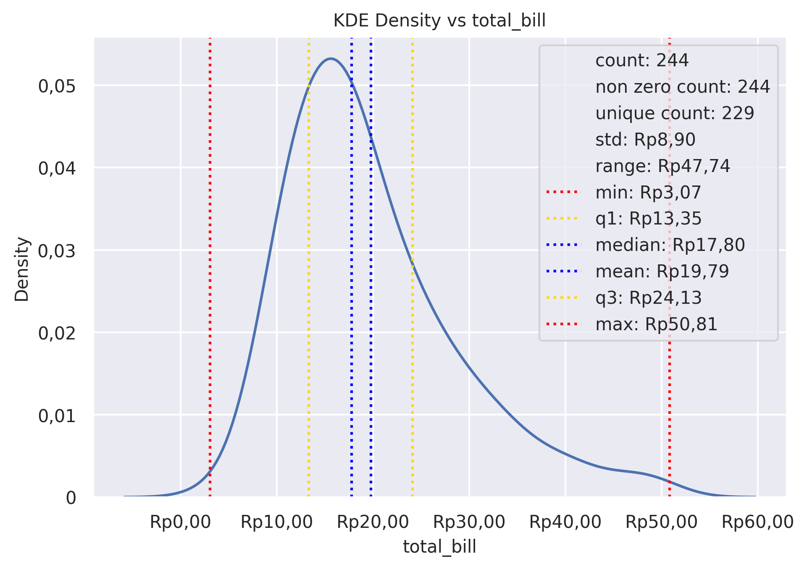

KDE Plot
========

Plot univariate or bivariate distributions using kernel density estimation.

**plot:** ``'kdeplot'``

.. rubric:: Plot-Specific Parameters

``hue`` *(str, list, numpy.ndarray, pandas.core.indexes.base.Index, or None, default: None)*
   Semantic variable that is mapped to determine the color of plot elements.

``weights`` *(str, list, numpy.ndarray, pandas.core.indexes.base.Index, or None, default: None)*
   If provided, weight the kernel density estimation using these values.

``palette`` *(str, list, matplotlib.colors.Colormap, or None, default: None)*
   Method for choosing the colors to use when mapping the hue semantic. String values are passed to color_palette(). List values imply categorical mapping, while a colormap object implies numeric mapping.

``hue_order`` *(list or None, default: None)*
   Specify the order of processing and plotting for categorical levels of the hue semantic.

``hue_norm`` *(tuple, matplotlib.colors.Normalize, or None, default: None)*
   Either a pair of values that set the normalization range in data units or an object that will map from data units into a 0 until 1 interval. Usage implies numeric mapping.

``color`` *(matplotlib.colors or None, default: None)*
   Single color specification for when hue mapping is not used. Otherwise, the plot will try to hook into the matplotlib property cycle.

``fill`` *(bool or None, default: None)*
   If True, fill in the area under univariate density curves or between bivariate contours. If None, the default depends on multiple.

``multiple`` *(str, default: 'layer')*
   Method for drawing multiple elements when semantic mapping creates subsets. Only relevant with univariate data.

``common_norm`` *(bool, default: True)*
   If True, scale each conditional density by the number of observations such that the total area under all densities sums to 1. Otherwise, normalize each density independently.

``common_grid`` *(bool, default: False)*
   If True, use the same evaluation grid for each kernel density estimate. Only relevant with univariate data.

``cumulative`` *(bool, default: False)*
   If True, estimate a cumulative distribution function.

``bw_method`` *(str, scalar, or callable, default: 'scott')*
   Method for determining the smoothing bandwidth to use; passed to scipy.stats.gaussian_kde.

``bw_adjust`` *(float, default: 1)*
   Factor that multiplicatively scales the value chosen using bw_method. Increasing will make the curve smoother.

``warn_singular`` *(bool, default: True)*
   If True, issue a warning when trying to estimate the density of data with zero variance.

``levels`` *(int or list, default: 10)*
   Number of contour levels or values to draw contours at. A vector argument must have increasing values in the range 0 until 1. Levels correspond to iso-proportions of the density: e.g., 20% of the probability mass will lie below the contour drawn for 0.2. Only relevant with bivariate data.

``thresh`` *(float, default: 0.05)*
   Lowest iso-proportion level at which to draw a contour line. Ignored when levels is a vector. Only relevant with bivariate data.

``gridsize`` *(int, default: 200)*
   Number of points on each dimension of the evaluation grid.

``cut`` *(float, default: 3)*
   Factor, multiplied by the smoothing bandwidth, that determines how far the evaluation grid extends past the extreme datapoints. When set to 0, truncate the curve at the data limits.

``clip`` *(pair of float, a pair of such pairs, or None, default: None)*
   Do not evaluate the density outside of these limits.

``legend`` *(bool, default: True)*
   If False, suppress the legend for semantic variables.

``cbar`` *(bool, default: False)*
   If True, add a colorbar to annotate the color mapping in a bivariate plot. Note: Does not currently support plots with a hue variable well.

``cbar_ax`` *(matplotlib.axes.Axes or None, default: None)*
   Pre-existing axes for the colorbar.

``cbar_kws`` *(dict or None, default: None)*
   Additional parameters passed to matplotlib.figure.Figure.colorbar().

``alpha`` *(float or None, default: None)*
   Proportional opacity of the points.

``zorder`` *(int or None, default: None)*
   Axes order. The default drawing order for axes is patches, lines, text for each plot order.

.. rubric:: Example

.. code-block:: python

   from grplot import plot2d
   import grplot_seaborn as gs
   gs.set_theme(context='notebook', style='darkgrid', palette='deep')

   tips = gs.load_dataset('tips')
   ax = plot2d(plot='kdeplot',
               df=tips,
               x='total_bill',
               xsep='.c',
               ysep='.',
               statdesc={'total_bill': 'general'},
               xtick_add='Rp(_)',
               title='KDE Density vs total_bill')

