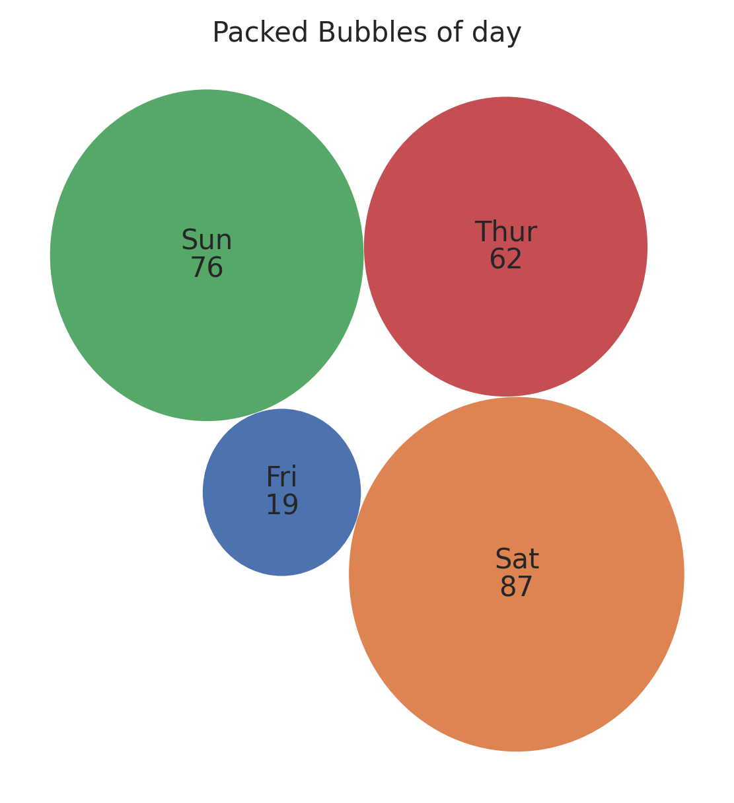

Packed Bubbles Plot
===================

Display hierarchical data as packed circles.

**plot:** ``'packedbubblesplot'``

.. rubric:: Plot-Specific Parameters

``bubble_spacing`` *(float, default: 0.1)*
   Space between bubbles.

``color`` *(list or None, default: None)*
   A sequence of colors through which the packed bubbles chart will cycle. If None, will use the colors in the currently active cycle.

.. code-block:: python

   from grplot import plot2d
   import grplot_seaborn as gs
   gs.set_theme(context='notebook', style='darkgrid', palette='deep')

   tips = gs.load_dataset('tips')
   ax = plot2d(plot='packedbubblesplot',
               df=tips,
               x='day',
               figsize=[6, 6],
               sep='.',
               text=True,
               title='Packed Bubbles of day')

