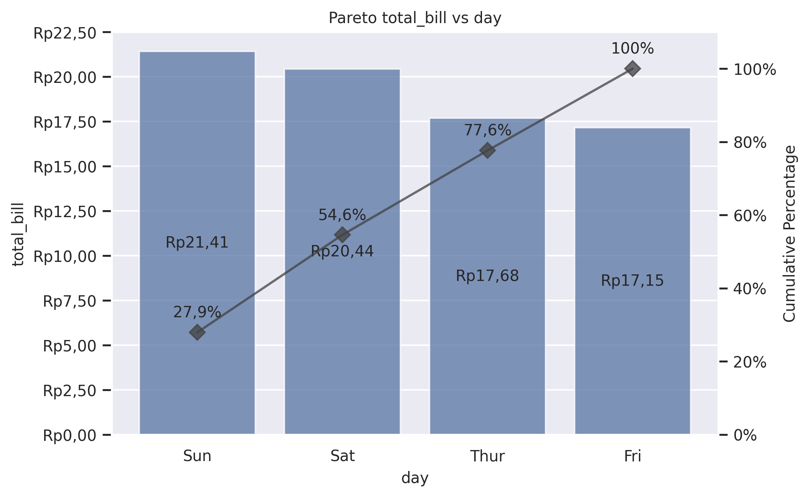

Pareto Plot
===========

Draw a combination of barplot and cumulative percentage line plot (80/20 analysis).

**plot:** ``'paretoplot'``

.. rubric:: Plot-Specific Parameters

``hue`` *(str, list, numpy.ndarray, pandas.core.indexes.base.Index, or None, default: None)*
   Semantic variable that is mapped to determine the color of plot elements.

``hue_order`` *(list or None, default: None)*
   Specify the order of processing and plotting for categorical levels of the hue semantic.

``estimator`` *(str, name of pandas method, callable, or None, default: 'mean')*
   Statistical function to estimate within each categorical bin.

``errorbar`` *(str, tuple, callable, or None, default: None)*
   Name of errorbar method (either "ci", "pi", "se", or "sd"), or a tuple with a method name and a level parameter, or a function that maps from a vector to a (min, max) interval, or None to hide errorbar.

``n_boot`` *(int, default: 1000)*
   Number of bootstrap iterations to use when computing confidence intervals.

``seed`` *(int, numpy.random.Generator, numpy.random.RandomState, or None, default: None)*
   Seed or random number generator for reproducible bootstrapping.

``units`` *(str, list, numpy.ndarray, pandas.core.indexes.base.Index, or None, default: None)*
   Identifier of sampling units, which will be used to perform a multilevel bootstrap and account for repeated measures design.

``weights`` *(str, list, numpy.ndarray, pandas.core.indexes.base.Index, or None, default: None)*
   Data values or column used to compute weighted statistics. Note that the use of weights may limit other statistical options.

``orient`` *(str or None, default: None)*
   Orientation of the plot (vertical or horizontal). This is usually inferred based on the type of the input variables, but it can be used to resolve ambiguity when both x and y are numeric or when plotting wide-form data.

``color`` *(matplotlib.colors or None, default: None)*
   Color for all of the elements, or seed for a gradient palette.

``palette`` *(str, list, matplotlib.colors.Colormap, or None, default: None)*
   Method for choosing the colors to use when mapping the hue semantic. String values are passed to color_palette(). List values imply categorical mapping, while a colormap object implies numeric mapping.

``saturation`` *(float, default: 0.75)*
   Proportion of the original saturation to draw colors at. Large patches often look better with slightly desaturated colors, but set this to 1 if you want the plot colors to perfectly match the input color spec.

``fill`` *(bool, default: True)*
   If True, use a solid patch. Otherwise, draw as line art.

``hue_norm`` *(tuple, matplotlib.colors.Normalize, or None, default: None)*
   Normalization in data units for colormap applied to the hue variable when it is numeric. Not relevant if hue is categorical.

``width`` *(float, default: 0.8)*
   Width allotted to each element on the orient axis. When native_scale=True, it is relative to the minimum distance between two values in the native scale.

``dodge`` *(str or bool, default: 'auto')*
   When hue mapping is used, whether elements should be narrowed and shifted along the orient axis to eliminate overlap. If "auto", set to True when the orient variable is crossed with the categorical variable or False otherwise.

``gap`` *(float, default: 0)*
   Shrink on the orient axis by this factor to add a gap between dodged elements.

``native_scale`` *(bool, default: False)*
   When True, numeric or datetime values on the categorical axis will maintain their original scaling rather than being converted to fixed indices.

``formatter`` *(callable or None, default: None)*
   Function for converting categorical data into strings. Affects both grouping and tick labels.

``legend`` *('auto', 'brief', 'full', or False, default: 'auto')*
   How to draw the legend. If "brief", numeric hue and size variables will be represented with a sample of evenly spaced values. If "full", every group will get an entry in the legend. If "auto", choose between brief or full representation based on number of levels. If False, no legend data is added and no legend is drawn.

``capsize`` *(float, default: None)*
   Width of the "caps" on error bars.

``err_kws`` *(dict or None, default: None)*
   Parameters of matplotlib.lines.Line2D, for the error bar artists.

``color2`` *(matplotlib.colors or None, default: None)*
   Line plot color for all of the elements, or seed for a gradient palette.

``marker`` *(str or matplotlib.markers, default: 'D')*
   The marker style. marker can be either an instance of the class or the text shorthand for a particular marker.

``markersize`` *(float, default: 7)*
   Marker size for line plot.

``alpha`` *(float or None, default: None)*
   Proportional opacity of the points.

``alpha2`` *(float or None, default: None)*
   Proportional opacity of the line.

``zorder`` *(int or None, default: None)*
   Axes order. The default drawing order for axes is patches, lines, text for each plot order.

.. code-block:: python

   from grplot import plot2d
   import grplot_seaborn as gs
   gs.set_theme(context='notebook', style='darkgrid', palette='deep')

   tips = gs.load_dataset('tips')
   ax = plot2d(plot='paretoplot',
               df=tips,
               x='day',
               y='total_bill',
               sep='.c',
               ytick_add='Rp(_)',
               ytext='h+i',
               alpha=0.75,
               alpha2=0.75,
               title='Pareto total_bill vs day')

