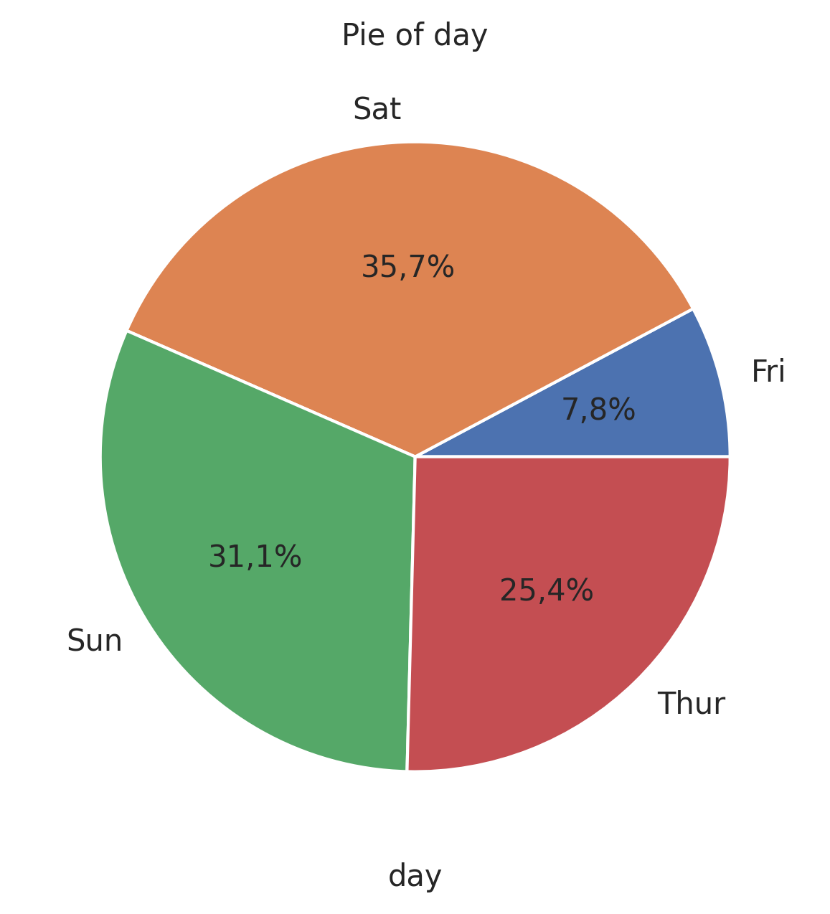

Pie Plot
========

Visualize proportional data as a pie chart.

**plot:** ``'pieplot'``

.. rubric:: Plot-Specific Parameters

``explode`` *(list or None, default: None)*
   If not None, is a len(x) array which specifies the fraction of the radius with which to offset each wedge.

``colors`` *(list or None, default: None)*
   A sequence of colors through which the pie chart will cycle. If None, will use the colors in the currently active cycle.

``hatch`` *(str, list, or None, default: None)*
   Hatching pattern applied to all pie wedges or sequence of patterns through which the chart will cycle.

``autopct`` *(str, callable, or None, default: sep)*
   If not None, is a string or function used to label the wedges with their numeric value. The label will be placed inside the wedge. If it is a format string, the label will be fmt % pct. If it is a function, it will be called.

``pctdistance`` *(float, default: 0.6)*
   The ratio between the center of each pie slice and the start of the text generated by autopct. Ignored if autopct is None.

``shadow`` *(bool, default: False)*
   Draw a shadow beneath the pie.

``normalize`` *(bool, default: True)*
   When True, always make a full pie by normalizing x so that sum(x) == 1. False makes a partial pie if sum(x) 1.

``labeldistance`` *(float or None, default: 1.1)*
   The radial distance at which the pie labels are drawn. If set to None, label are not drawn, but are stored for use in legend().

``startangle`` *(float, default: 0)*
   The angle by which the start of the pie is rotated, counterclockwise from the x-axis.

``radius`` *(float, default: 1)*
   The radius of the pie.

``counterclock`` *(bool, default: True)*
   Specify fractions direction, clockwise or counterclockwise.

``wedgeprops`` *(dict or None, default: None)*
   Dict of arguments passed to the wedge objects making the pie. For example, you can pass in wedgeprops = {'linewidth': 3} to set the width of the wedge border lines equal to 3. For more details, look at the doc/arguments of matplotlib wedge object. By default clip_on=False.

``textprops`` *(dict or None, default: None)*
   Dict of arguments to pass to the text objects.

``center`` *([float, float], default: [0, 0])*
   0] The coordinates of the center of the chart.

``frame`` *(bool, default: False)*
   Plot Axes frame with the chart if true.

``rotatelabels`` *(bool, default: False)*
   Plot Axes frame with the chart if true.

.. code-block:: python

   from grplot import plot2d
   import grplot_seaborn as gs
   gs.set_theme(context='notebook', style='darkgrid', palette='deep')

   tips = gs.load_dataset('tips')
   ax = plot2d(plot='pieplot',
               df=tips,
               x='day',
               sep='.',
               text=True,
               title='Pie of day')

