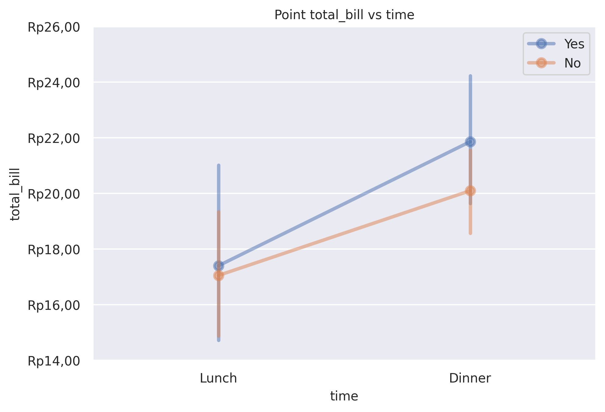
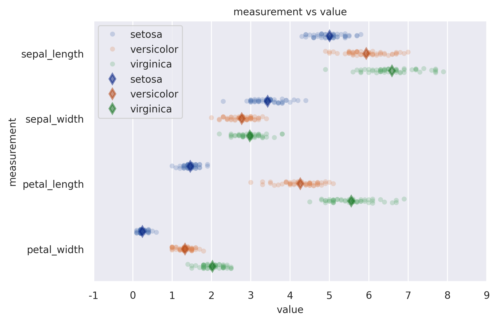

Point Plot
==========

Show point estimates and confidence intervals using scatter plot glyphs.

**plot:** ``'pointplot'``

.. rubric:: Plot-Specific Parameters

``hue`` *(str, list, numpy.ndarray, pandas.core.indexes.base.Index, or None, default: None)*
   Semantic variable that is mapped to determine the color of plot elements.

``order`` *(list or None, default: None)*
   Order to plot the categorical levels in, otherwise the levels are inferred from the data objects.

``hue_order`` *(list or None, default: None)*
   Specify the order of processing and plotting for categorical levels of the hue semantic.

``estimator`` *(str, name of pandas method, callable, or None, default: 'mean')*
   Statistical function to estimate within each categorical bin.

``errorbar`` *(str, tuple, callable, or None, default: None)*
   Name of errorbar method (either "ci", "pi", "se", or "sd"), or a tuple with a method name and a level parameter, or a function that maps from a vector to a (min, max) interval, or None to hide errorbar. See the errorbar tutorial for more information.

``n_boot`` *(int, default: 1000)*
   Number of bootstrap iterations to use when computing confidence intervals.

``seed`` *(int, numpy.random.Generator, numpy.random.RandomState, or None, default: None)*
   Seed or random number generator for reproducible bootstrapping.

``units`` *(str, list, numpy.ndarray, pandas.core.indexes.base.Index, or None, default: None)*
   Identifier of sampling units, which will be used to perform a multilevel bootstrap and account for repeated measures design.

``weights`` *(str, list, numpy.ndarray, pandas.core.indexes.base.Index, or None, default: None)*
   Data values or column used to compute weighted statistics. Note that the use of weights may limit other statistical options.

``color`` *(matplotlib.colors or None, default: None)*
   Color for all of the elements, or seed for a gradient palette.

``palette`` *(str, list, matplotlib.colors.Colormap, or None, default: None)*
   Method for choosing the colors to use when mapping the hue semantic. String values are passed to color_palette(). List values imply categorical mapping, while a colormap object implies numeric mapping.

``markers`` *(str or list, default: 'o')*
   Markers to use for each of the hue levels.

``linestyles`` *(str or list, default: '-')*
   Line styles to use for each of the hue levels.

``dodge`` *(bool or float, default: False)*
   Amount to separate the points for each level of the hue variable along the categorical axis.

``orient`` *(str or None, default: None)*
   Orientation of the plot (vertical or horizontal). This is usually inferred based on the type of the input variables, but it can be used to resolve ambiguity when both x and y are numeric or when plotting wide-form data.

``capsize`` *(float, default: None)*
   Width of the “caps” on error bars.

``native_scale`` *(bool, default: False)*
   When True, numeric or datetime values on the categorical axis will maintain their original scaling rather than being converted to fixed indices.

``formatter`` *(callable or None, default: None)*
   Function for converting categorical data into strings. Affects both grouping and tick labels.

``legend`` *('auto', 'brief', 'full', or False, default: 'auto')*
   How to draw the legend. If "brief", numeric hue and size variables will be represented with a sample of evenly spaced values. If "full", every group will get an entry in the legend. If "auto", choose between brief or full representation based on number of levels. If False, no legend data is added and no legend is drawn.

``zorder`` *(int or None, default: None)*
   Axes order. The default drawing order for axes is patches, lines, text for each plot order.

.. rubric:: Example 1

.. code-block:: python

   from grplot import plot2d
   import grplot_seaborn as gs
   gs.set_theme(context='notebook', style='darkgrid', palette='deep')

   tips = gs.load_dataset('tips')
   ax = plot2d(plot='pointplot',
               df=tips,
               x='time',
               y='total_bill',
               sep='.c',
               ytick_add='Rp(_)',
               title='Point total_bill vs time',
               hue='smoker',
               errorbar=('ci', 95))

.. rubric:: Example 2

.. code-block:: python

   from grplot import plot2d
   import grplot_seaborn as gs
   import pandas as pd
   gs.set_theme(context='notebook', style='darkgrid', palette='deep')

   iris = gs.load_dataset('iris')
   iris = pd.melt(iris, 'species', var_name='measurement')
   ax = plot2d(plot='stripplot+pointplot',
               df=iris,
               x='value', 
               y='measurement',
               sep='.',
               title='measurement vs value',
               hue='species')

