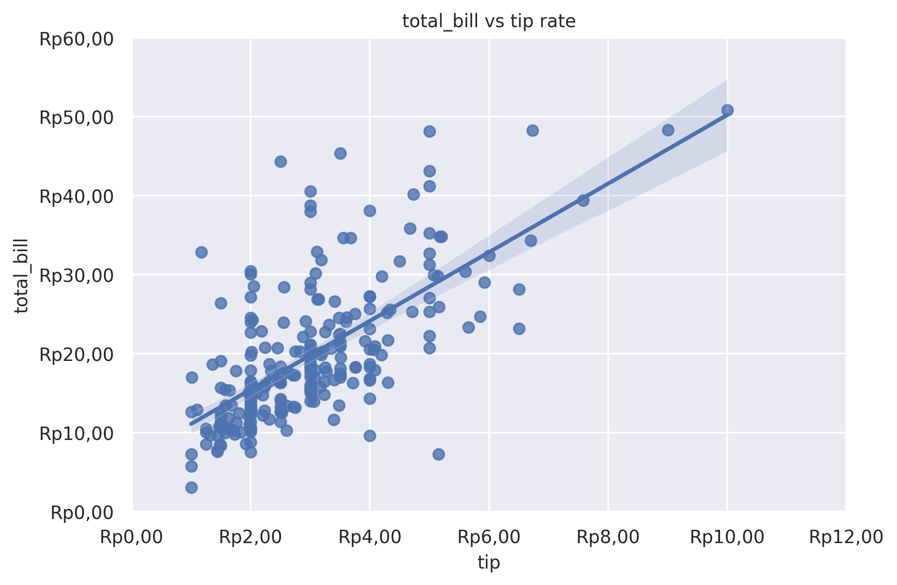
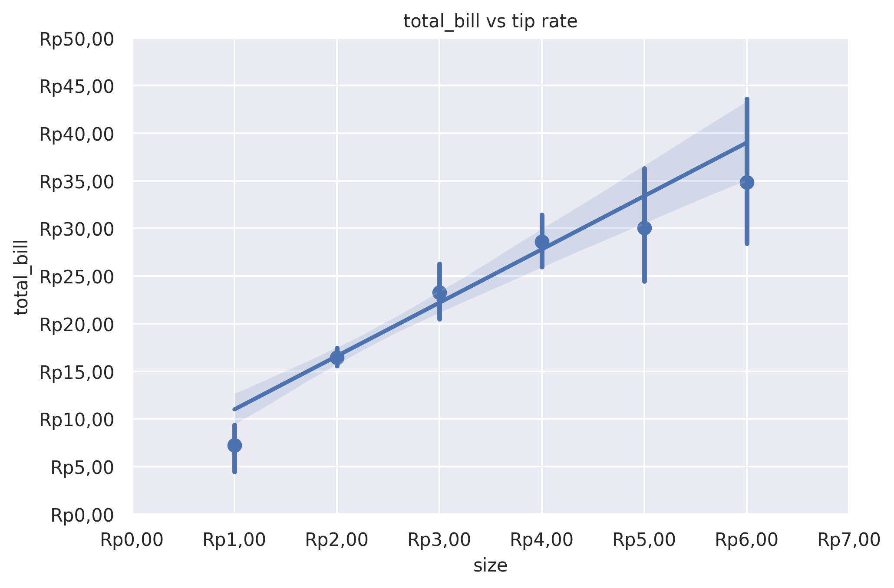

Reg Plot
========

Plot data and a linear regression model fit.

**plot:** ``'regplot'``

.. rubric:: Plot-Specific Parameters

``x_estimator`` *(name of pandas method, callable, or None, default: None)*
   Apply this function to each unique value of x and plot the resulting estimate. This is useful when x is a discrete variable. If x_ci is given, this estimate will be bootstrapped and a confidence interval will be drawn.

``x_bins`` *(int, list, or None, default: None)*
   Bin the x variable into discrete bins and then estimate the central tendency and a confidence interval. This binning only influences how the scatterplot is drawn; the regression is still fit to the original data. This parameter is interpreted either as the number of evenly-sized (not necessary spaced) bins or the positions of the bin centers. When this parameter is used, it implies that the default of x_estimator is numpy.mean.

``x_ci`` *(str, int, or None, default: None)*
   Size of the confidence interval used when plotting a central tendency for discrete values of x. If 'ci', defer to the value of the ci parameter. If 'sd', skip bootstrapping and show the standard deviation of the observations in each bin.

``scatter`` *(bool, default: True)*
   If True, draw a scatterplot with the underlying observations (or the x_estimator values).

``fit_reg`` *(bool, default: True)*
   If True, estimate and plot a regression model relating the x and y variables.

``ci`` *(int or None, default: None)*
   Size of the confidence interval for the regression estimate. This will be drawn using translucent bands around the regression line. The confidence interval is estimated using a bootstrap; for large datasets, it may be advisable to avoid that computation by setting this parameter to None.

``n_boot`` *(int, default: 1000)*
   Number of bootstrap resamples used to estimate the ci. The default value attempts to balance time and stability; you may want to increase this value for 'final' versions of plots.

``units`` *(str or None, default: None)*
   If the x and y observations are nested within sampling units, those can be specified here. This will be taken into account when computing the confidence intervals by performing a multilevel bootstrap that resamples both units and observations (within unit). This does not otherwise influence how the regression is estimated or drawn.

``seed`` *(int, numpy.random.Generator, numpy.random.RandomState, or None, default: None)*
   Seed or random number generator for reproducible bootstrapping.

``order`` *(int or None, default: 1)*
   If order is greater than 1, use numpy.polyfit to estimate a polynomial regression.

``logistic`` *(bool or None, default: False)*
   If True, assume that y is a binary variable and use statsmodels to estimate a logistic regression model. Note that this is substantially more computationally intensive than linear regression, so you may wish to decrease the number of bootstrap resamples (n_boot) or set ci to None.

``lowess`` *(bool or None, default: False)*
   If True, use statsmodels to estimate a nonparametric lowess model (locally weighted linear regression). Note that confidence intervals cannot currently be drawn for this kind of model.

``robust`` *(bool or None, default: False)*
   If True, use statsmodels to estimate a robust regression. This will de-weight outliers. Note that this is substantially more computationally intensive than standard linear regression, so you may wish to decrease the number of bootstrap resamples (n_boot) or set ci to None.

``regplot_logx`` *(bool or None, default: False)*
   If True, estimate a linear regression of the form y ~ log(x), but plot the scatterplot and regression model in the input space. Note that x must be positive for this to work.

``x_partial`` *(str or None, default: None)*
   Confounding variables to regress out of the x variable before plotting.

``y_partial`` *(str or None, default: None)*
   Confounding variables to regress out of the y variable before plotting.

``truncate`` *(bool or None, default: True)*
   If True, the regression line is bounded by the data limits. If False, it extends to the x axis limits.

``x_jitter`` *(float or None, default: None)*
   Add uniform random noise of this size to the x variable. The noise is added to a copy of the data after fitting the regression, and only influences the look of the scatterplot. This can be helpful when plotting variables that take discrete values.

``y_jitter`` *(float or None, default: None)*
   Add uniform random noise of this size to the y variable. The noise is added to a copy of the data after fitting the regression, and only influences the look of the scatterplot. This can be helpful when plotting variables that take discrete values.

``label`` *(str or None, default: None)*
   Label to apply to either the scatterplot or regression line (if scatter is False) for use in a legend.

``color`` *(matplotlib.colors or None, default: None)*
   Color to apply to all plot elements; will be superseded by colors passed in scatter_kws or line_kws.

``marker`` *(matplotlib.markers or None, default: 'o')*
   Marker to use for the scatterplot glyphs.

``scatter_kws`` *(dict or None, default: None)*
   Additional keyword arguments to pass to plt.scatter.

``line_kws`` *(dict or None, default: None)*
   Additional keyword arguments to pass to plt.plot.

.. rubric:: Example 1

.. code-block:: python

   from grplot import plot2d
   import grplot_seaborn as gs
   gs.set_theme(context='notebook', style='darkgrid', palette='deep')

   tips = gs.load_dataset('tips')
   ax = plot2d(plot='regplot',
               df=tips,
               x='tip',
               y='total_bill',
               sep='.c',
               tick_add='Rp(_)',
               title='total_bill vs tip rate',
               ci=95)

.. rubric:: Example 2

.. code-block:: python

   from grplot import plot2d
   import grplot_seaborn as gs
   import numpy as np
   gs.set_theme(context='notebook', style='darkgrid', palette='deep')

   tips = gs.load_dataset('tips')
   ax = plot2d(plot='regplot', 
               df=tips, 
               x='size', 
               y='total_bill', 
               sep='.c', 
               tick_add='Rp(_)',
               title='total_bill vs tip rate',
               ci=95,
               x_ci='ci',
               x_estimator=np.mean)

