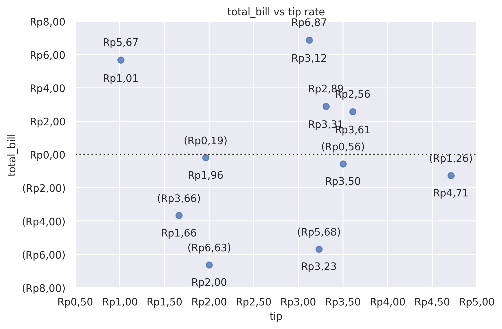

Resid Plot
==========

Plot the residuals of a linear regression.

**plot:** ``'residplot'``

.. rubric:: Plot-Specific Parameters

``lowess`` *(bool or None, default: False)*
   Fit a lowess smoother to the residual scatterplot.

``x_partial`` *(str or None, default: None)*
   Confounding variables to regress out of the x variable before plotting.

``y_partial`` *(str or None, default: None)*
   Confounding variables to regress out of the y variable before plotting.

``order`` *(int or None, default: 1)*
   Order of the polynomial to fit when calculating the residuals.

``robust`` *(bool or None, default: False)*
   Fit a robust linear regression when calculating the residuals.

``dropna`` *(bool or None, default: True)*
   If True, ignore observations with missing data when fitting and plotting.

``label`` *(str or None, default: None)*
   Label that will be used in any plot legends.

``color`` *(matplotlib.colors or None, default: None)*
   Color to use for all elements of the plot.

``scatter_kws`` *(dict or None, default: None)*
   Additional keyword arguments to pass to plt.scatter.

``line_kws`` *(dict or None, default: None)*
   Additional keyword arguments to pass to plt.plot.

.. code-block:: python

   from grplot import plot2d
   import grplot_seaborn as gs
   gs.set_theme(context='notebook', style='darkgrid', palette='deep')

   tips = gs.load_dataset('tips')
   ax = plot2d(plot='residplot',
               df=tips.head(10),
               x='tip',
               y='total_bill',
               sep='.c',
               text=True,
               tick_add='Rp(_)',
               title='total_bill vs tip rate')

