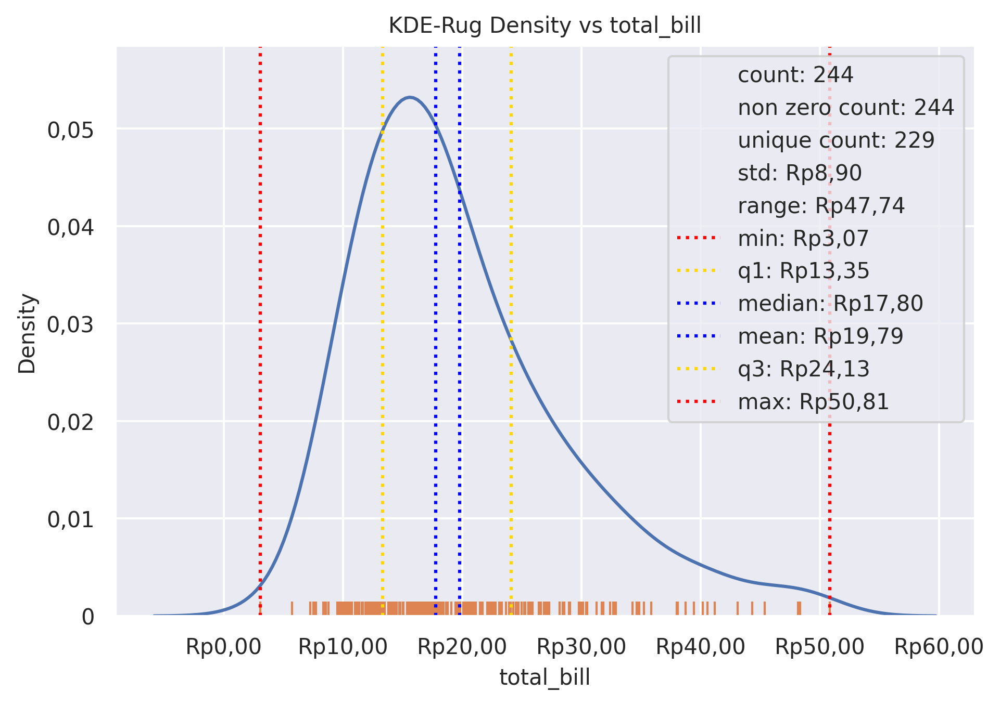
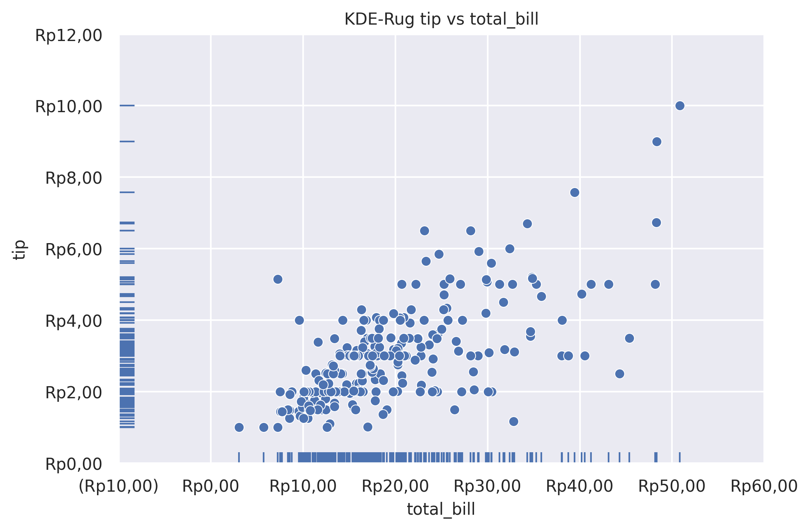

Rug Plot
========

Plot marginal distributions by drawing ticks along the x and y axes.
Commonly combined with ``kdeplot``.

**plot:** ``'rugplot'``

.. rubric:: Plot-Specific Parameters

``hue`` *(str, list, numpy.ndarray, pandas.core.indexes.base.Index, or None, default: None)*
   Semantic variable that is mapped to determine the color of plot elements.

``height`` *(float, default: 0.025)*
   Proportion of axes extent covered by each rug element.

``expand_margins`` *(bool, default: True)*
   If True, increase the axes margins by the height of the rug to avoid overlap with other elements.

``palette`` *(str, list, matplotlib.colors.Colormap, or None, default: None)*
   Method for choosing the colors to use when mapping the hue semantic. String values are passed to color_palette(). List values imply categorical mapping, while a colormap object implies numeric mapping.

``hue_order`` *(list or None, default: None)*
   Specify the order of processing and plotting for categorical levels of the hue semantic.

``hue_norm`` *(tuple, matplotlib.colors.Normalize, or None, default: None)*
   Either a pair of values that set the normalization range in data units or an object that will map from data units into a 0 until 1 interval. Usage implies numeric mapping.

``legend`` *(bool, default: True)*
   If False, do not add a legend for semantic variables.

``alpha`` *(float or None, default: None)*
   Proportional opacity of the points.

``zorder`` *(int or None, default: None)*
   Axes order. The default drawing order for axes is patches, lines, text for each plot order.

.. rubric:: Example 1

.. code-block:: python

   from grplot import plot2d
   import grplot_seaborn as gs
   gs.set_theme(context='notebook', style='darkgrid', palette='deep')

   tips = gs.load_dataset('tips')
   ax = plot2d(plot='kdeplot+rugplot',
               df=tips,
               x='total_bill',
               xsep='.c',
               ysep='.',
               statdesc={'total_bill': 'general'},
               xtick_add='Rp(_)',
               title='KDE-Rug Density vs total_bill')

.. rubric:: Example 2

.. code-block:: python

   from grplot import plot2d
   import grplot_seaborn as gs
   gs.set_theme(context='notebook', style='darkgrid', palette='deep')

   tips = gs.load_dataset('tips')
   ax = plot2d(plot='scatterplot+rugplot', 
               df=tips, 
               x='total_bill', 
               y='tip',
               sep='.c',
               tick_add='Rp(_)', 
               title='KDE-Rug tip vs total_bill')

