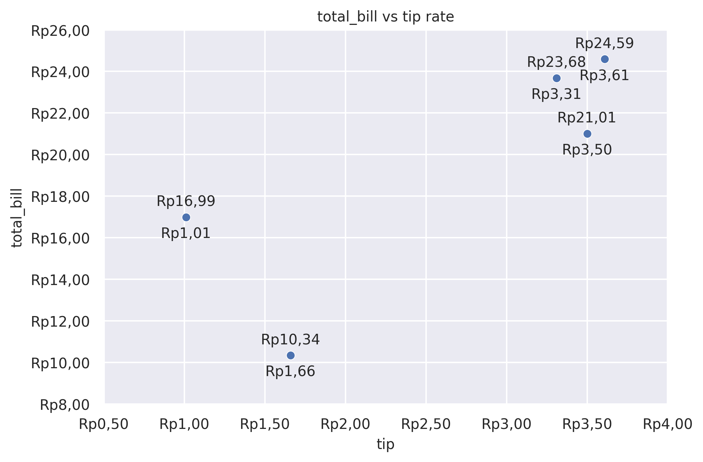

Scatter Plot
============

Draw a scatter plot with possibility of several semantic groupings.

**plot:** ``'scatterplot'``

.. rubric:: Plot-Specific Parameters

``hue`` *(str, list, numpy.ndarray, pandas.core.indexes.base.Index, or None, default: None)*
   Grouping variable that will produce points with different colors. Can be either categorical or numeric, although color mapping will behave differently in latter case.

``size`` *(str, list, numpy.ndarray, pandas.core.indexes.base.Index, or None, default: None)*
   Grouping variable that will produce points with different sizes. Can be either categorical or numeric, although size mapping will behave differently in latter case.

``style`` *(str, list, numpy.ndarray, pandas.core.indexes.base.Index, or None, default: None)*
   Grouping variable that will produce points with different markers. Can have a numeric dtype but will always be treated as categorical.

``palette`` *(str, list, matplotlib.colors.Colormap, or None, default: None)*
   Method for choosing the colors to use when mapping the hue semantic. String values are passed to color_palette(). List values imply categorical mapping, while a colormap object implies numeric mapping.

``hue_order`` *(list or None, default: None)*
   Specify the order of processing and plotting for categorical levels of the hue semantic.

``hue_norm`` *(tuple, matplotlib.colors.Normalize, or None, default: None)*
   Either a pair of values that set the normalization range in data units or an object that will map from data units into a 0 until 1 interval. Usage implies numeric mapping.

``sizes`` *(list, tuple, or None, default: None)*
   An object that determines how sizes are chosen when size is used. It can always be a list of size values. When size is numeric, it can also be a tuple specifying the minimum and maximum size to use such that other values are normalized within this range.

``size_order`` *(list or None, default: None)*
   Specified order for appearance of the size variable levels, otherwise they are determined from the data. Not relevant when the size variable is numeric.

``size_norm`` *(tuple, Normalize object, or None, default: None)*
   Normalization in data units for scaling plot objects when the size variable is numeric.

``markers`` *(bool or list, default: True)*
   Object determining how to draw the markers for different levels of the style variable. Setting to True will use default markers, or you can pass a list of markers or a dictionary mapping levels of the style variable to markers. Setting to False will draw marker-less lines. Markers are specified as in matplotlib.

``style_order`` *(list or None, default: None)*
   Specified order for appearance of the style variable levels otherwise they are determined from the data. Not relevant when the style variable is numeric.

``alpha`` *(float or None, default: None)*
   Proportional opacity of the points.

``legend`` *(str or bool, default: 'auto')*
   How to draw the legend. If 'brief', numeric hue and size variables will be represented with a sample of evenly spaced values. If 'full', every group will get an entry in the legend. If 'auto', choose between brief or full representation based on number of levels. If False, no legend data is added and no legend is drawn.

``zorder`` *(int or None, default: None)*
   Axes order. The default drawing order for axes is patches, lines, text for each plot order.

.. code-block:: python

   from grplot import plot2d
   import grplot_seaborn as gs
   gs.set_theme(context='notebook', style='darkgrid', palette='deep')

   tips = gs.load_dataset('tips')
   ax = plot2d(plot='scatterplot',
               df=tips.head(5),
               x='tip',
               y='total_bill',
               sep='.c',
               tick_add='Rp(_)',
               text=True,
               title='total_bill vs tip rate')

