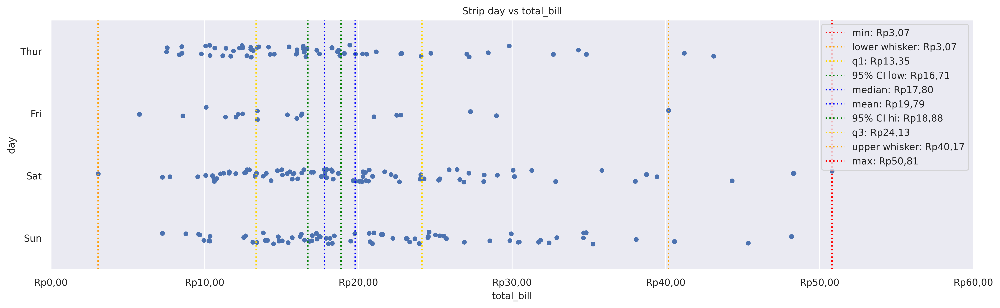
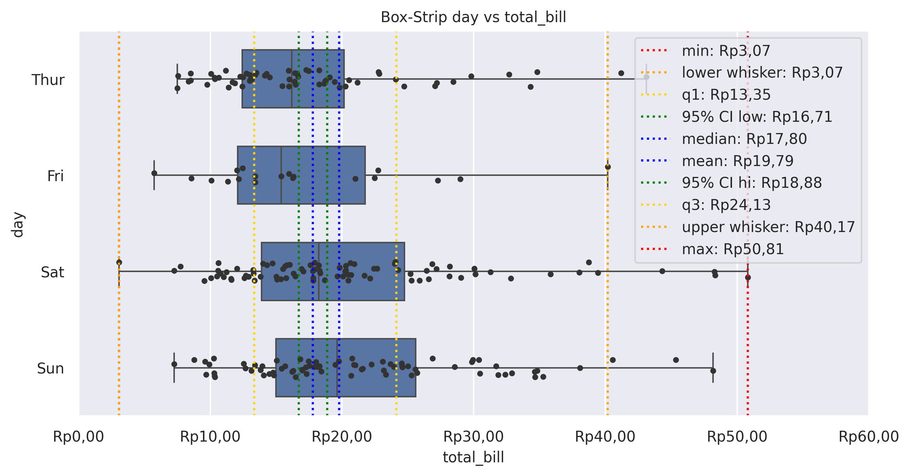
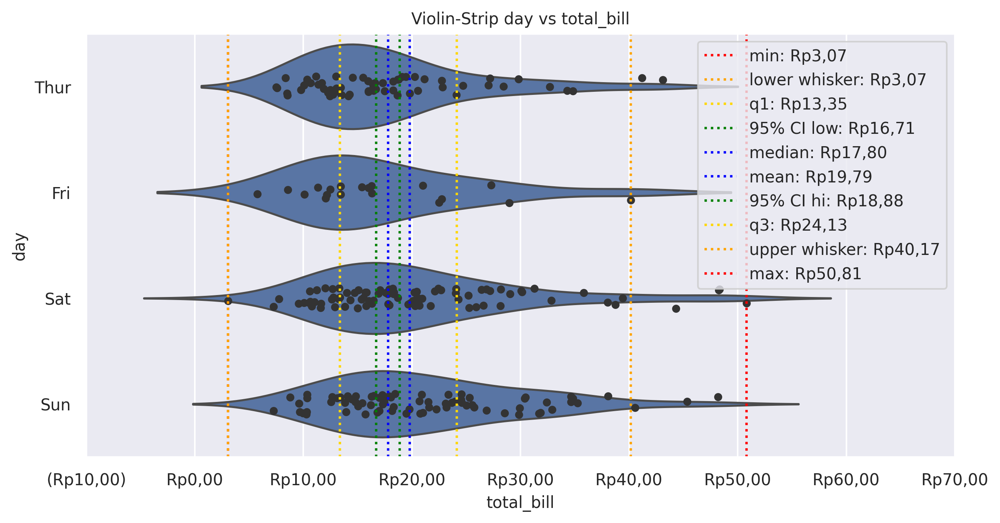

Strip Plot
==========

Draw a categorical scatter plot using jitter.

**plot:** ``'stripplot'``

.. rubric:: Plot-Specific Parameters

``hue`` *(str, list, numpy.ndarray, pandas.core.indexes.base.Index, or None, default: None)*
   Semantic variable that is mapped to determine the color of plot elements.

``order`` *(list or None, default: None)*
   Order to plot the categorical levels in, otherwise the levels are inferred from the data objects.

``hue_order`` *(list or None, default: None)*
   Specify the order of processing and plotting for categorical levels of the hue semantic.

``jitter`` *(float or bool, default: True)*
   Amount of jitter (only along the categorical axis) to apply. This can be useful when you have many points and they overlap, so that it is easier to see the distribution. You can specify the amount of jitter (half the width of the uniform random variable support), or just use True for a good default.

``dodge`` *(bool, default: False)*
   When using hue nesting, setting this to True will separate the strips for different hue levels along the categorical axis. Otherwise, the points for each level will be plotted on top of each other.

``orient`` *(str, default: None)*
   Orientation of the plot (vertical or horizontal). This is usually inferred based on the type of the input variables, but it can be used to resolve ambiguity when both x and y are numeric or when plotting wide-form data.

``color`` *(matplotlib.colors or None, default: None)*
   Color for all of the elements, or seed for a gradient palette.

``palette`` *(str, list, matplotlib.colors.Colormap, or None, default: None)*
   Method for choosing the colors to use when mapping the hue semantic. String values are passed to color_palette(). List values imply categorical mapping, while a colormap object implies numeric mapping.

``size`` *(float or None, default: 5)*
   Radius of the markers, in points.

``edgecolor`` *(matplotlib.colors, default: 'auto')*
   Color of the lines around each point. If you pass 'gray', the brightness is determined by the color palette used for the body of the points.

``linewidth`` *(float, default: 0)*
   Width of the gray lines that frame the plot elements.

``hue_norm`` *(tuple, matplotlib.colors.Normalize, or None, default: None)*
   Normalization in data units for colormap applied to the hue variable when it is numeric. Not relevant if hue is categorical.

``native_scale`` *(bool, default: False)*
   When True, numeric or datetime values on the categorical axis will maintain their original scaling rather than being converted to fixed indices.

``formatter`` *(callable or None, default: None)*
   Function for converting categorical data into strings. Affects both grouping and tick labels.

``legend`` *('auto', 'brief', 'full', or False, default: 'auto')*
   How to draw the legend. If "brief", numeric hue and size variables will be represented with a sample of evenly spaced values. If "full", every group will get an entry in the legend. If "auto", choose between brief or full representation based on number of levels. If False, no legend data is added and no legend is drawn.

``alpha`` *(float or None, default: None)*
   Proportional opacity of the points.

``zorder`` *(int or None, default: None)*
   Axes order. The default drawing order for axes is patches, lines, text for each plot order.

.. rubric:: Example 1

.. code-block:: python

   from grplot import plot2d
   import grplot_seaborn as gs
   gs.set_theme(context='notebook', style='darkgrid', palette='deep')

   tips = gs.load_dataset('tips')
   ax = plot2d(plot='stripplot',
               df=tips,
               x='total_bill',
               y='day',
               figsize=[16, 6],
               sep='.c',
               xstatdesc='boxplot',
               xtick_add='Rp(_)',
               title='Strip day vs total_bill')

.. rubric:: Example 2

.. code-block:: python

   from grplot import plot2d
   import grplot_seaborn as gs
   gs.set_theme(context='notebook', style='darkgrid', palette='deep')

   tips = gs.load_dataset('tips')
   ax = plot2d(plot='boxplot+stripplot', 
               df=tips, 
               x='total_bill',
               y='day',
               figsize=[10,6],
               sep='.c',
               xstatdesc='boxplot',     
               xtick_add='Rp(_)', 
               title='Box-Strip day vs total_bill')

.. rubric:: Example 3

.. code-block:: python

   from grplot import plot2d
   import grplot_seaborn as gs
   gs.set_theme(context='notebook', style='darkgrid', palette='deep')

   tips = gs.load_dataset('tips')
   ax = plot2d(plot='violinplot+stripplot', 
               df=tips, 
               x='total_bill',
               y='day',
               figsize=[10,6],
               sep='.c',
               xstatdesc='boxplot',     
               xtick_add='Rp(_)', 
               title='Violin-Strip day vs total_bill')

