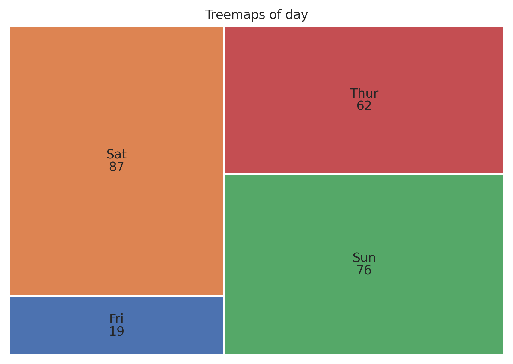

Treemaps Plot
=============

Display hierarchical data as nested rectangles.

**plot:** ``'treemapsplot'``

.. rubric:: Plot-Specific Parameters

``norm_x`` *(float, default: 100)*
   x value for normalization.

``norm_y`` *(float, default: 100)*
   y value for normalization.

``color`` *(list or None, default: None)*
   A sequence of colors through which the treemaps chart will cycle. If None, will use the colors in the currently active cycle.

``treemaps_pad`` *(bool, default: False)*
   Draw rectangles with a small gap between them.

``bar_kwargs`` *(dict or None, default: None)*
   Keyword arguments passed to matplotlib.Axes.bar.

``text_kwargs`` *(dict or None, default: None)*
   Keyword arguments passed to matplotlib.Axes.text.

.. code-block:: python

   from grplot import plot2d
   import grplot_seaborn as gs
   gs.set_theme(context='notebook', style='darkgrid', palette='deep')

   tips = gs.load_dataset('tips')
   ax = plot2d(plot='treemapsplot',
               df=tips,
               x='day',
               sep='.',
               text=True,
               title='Treemaps of day')

