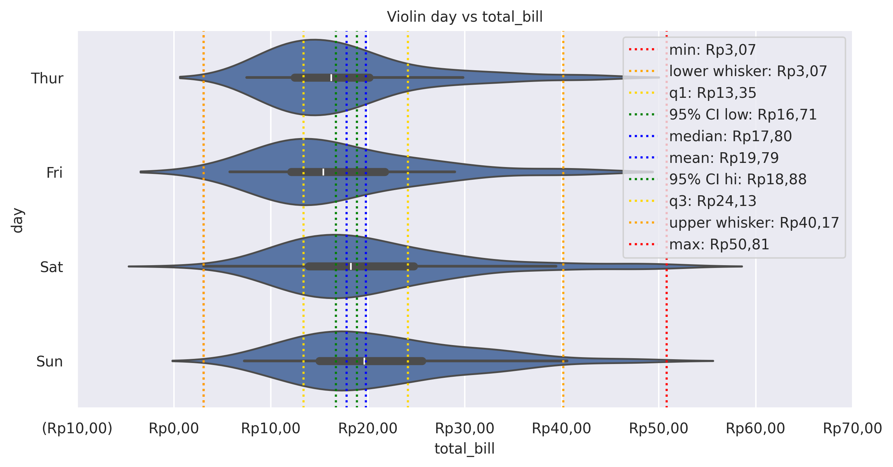

Violin Plot
===========

Draw a combination of boxplot and kernel density estimate.

**plot:** ``'violinplot'``

.. rubric:: Plot-Specific Parameters

``hue`` *(str, list, numpy.ndarray, pandas.core.indexes.base.Index, or None, default: None)*
   Semantic variable that is mapped to determine the color of plot elements.

``order`` *(list or None, default: None)*
   Order to plot the categorical levels in, otherwise the levels are inferred from the data objects.

``hue_order`` *(list or None, default: None)*
   Specify the order of processing and plotting for categorical levels of the hue semantic.

``orient`` *(str or None, default: None)*
   Orientation of the plot (vertical or horizontal). This is usually inferred based on the type of the input variables, but it can be used to resolve ambiguity when both x and y are numeric or when plotting wide-form data.

``color`` *(matplotlib.colors or None, default: None)*
   Color for all of the elements, or seed for a gradient palette.

``palette`` *(str, list, matplotlib.colors.Colormap, or None, default: None)*
   Method for choosing the colors to use when mapping the hue semantic. String values are passed to color_palette(). List values imply categorical mapping, while a colormap object implies numeric mapping.

``saturation`` *(float, default: 0.75)*
   Proportion of the original saturation to draw colors at. Large patches often look better with slightly desaturated colors, but set this to 1 if you want the plot colors to perfectly match the input color spec.

``fill`` *(bool, default: True)*
   If True, use a solid patch. Otherwise, draw as line art.

``inner`` *(str or None, default: None)*
   Representation of the data in the violin interior. One of the following: - "box": draw a miniature box-and-whisker plot - "quart": show the quartiles of the data - "point" or "stick": show each observation

``split`` *(bool or None, default: False)*
   Show an un-mirrored distribution, alternating sides when using hue.

``width`` *(float, default: 0.8)*
   Width allotted to each element on the orient axis. When native_scale=True, it is relative to the minimum distance between two values in the native scale.

``dodge`` *(str or bool, default: 'auto')*
   When hue mapping is used, whether elements should be narrowed and shifted along the orient axis to eliminate overlap. If "auto", set to True when the orient variable is crossed with the categorical variable or False otherwise.

``gap`` *(float, default: 0)*
   Shrink on the orient axis by this factor to add a gap between dodged elements.

``linewidth`` *(float or None, default: None)*
   Width of the gray lines that frame the plot elements.

``linecolor`` *(str or None, default: 'auto')*
   Color to use for line elements, when fill is True.

``cut`` *(float, default: 2)*
   Distance, in units of bandwidth size, to extend the density past the extreme datapoints. Set to 0 to limit the violin range within the range of the observed data (i.e., to have the same effect as trim=True in ggplot).

``gridsize`` *(int, default: 100)*
   Number of points in the discrete grid used to compute the kernel density estimate.

``bw_method`` *(str or float, default: 'scott')*
   Either the name of a reference rule or the scale factor to use when computing the kernel bandwidth. The actual kernel size will be determined by multiplying the scale factor by the standard deviation of the data within each bin.

``bw_adjust`` *(float, default: 1)*
   Factor that scales the bandwidth to use more or less smoothing.

``density_norm`` *(str, default: 'area')*
   Method that normalizes each density to determine the violin’s width. If area, each violin will have the same area. If count, the width will be proportional to the number of observations. If width, each violin will have the same width.

``common_norm`` *(bool, default: False)*
   When True, normalize the density across all violins.

``hue_norm`` *(tuple or matplotlib.colors.Normalize, default: None)*
   Normalization in data units for colormap applied to the hue variable when it is numeric. Not relevant if hue is categorical.

``native_scale`` *(bool, default: False)*
   When True, numeric or datetime values on the categorical axis will maintain their original scaling rather than being converted to fixed indices.

``formatter`` *(callable or None, default: None)*
   Function for converting categorical data into strings. Affects both grouping and tick labels.

``legend`` *('auto', 'brief', 'full', or False, default: 'auto')*
   How to draw the legend. If "brief", numeric hue and size variables will be represented with a sample of evenly spaced values. If "full", every group will get an entry in the legend. If "auto", choose between brief or full representation based on number of levels. If False, no legend data is added and no legend is drawn.

``zorder`` *(int or None, default: None)*
   Axes order. The default drawing order for axes is patches, lines, text for each plot order.

.. code-block:: python

   from grplot import plot2d
   import grplot_seaborn as gs
   gs.set_theme(context='notebook', style='darkgrid', palette='deep')

   tips = gs.load_dataset('tips')
   ax = plot2d(plot='violinplot',
               df=tips,
               x='total_bill',
               y='day',
               figsize=[10, 6],
               sep='.c',
               xstatdesc='boxplot',
               xtick_add='Rp(_)',
               title='Violin day vs total_bill',
               inner='box')

