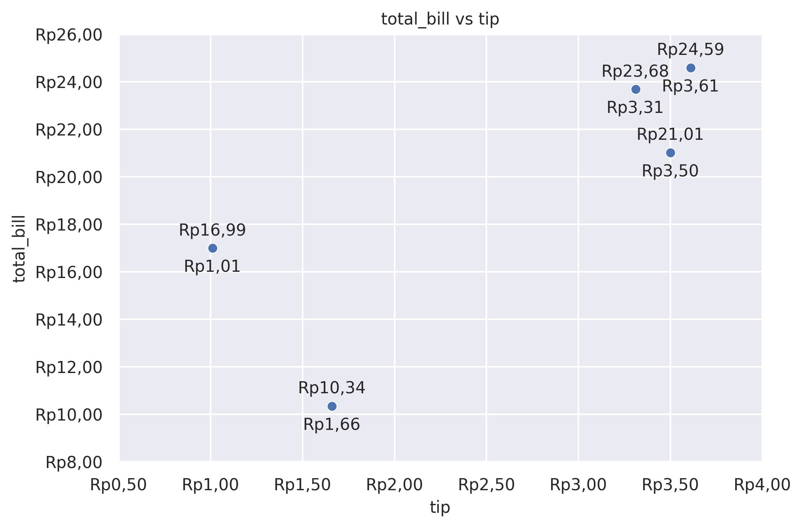
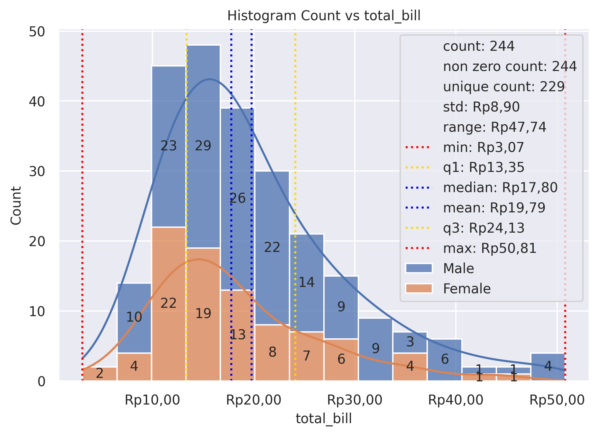
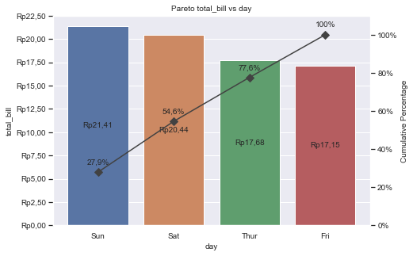
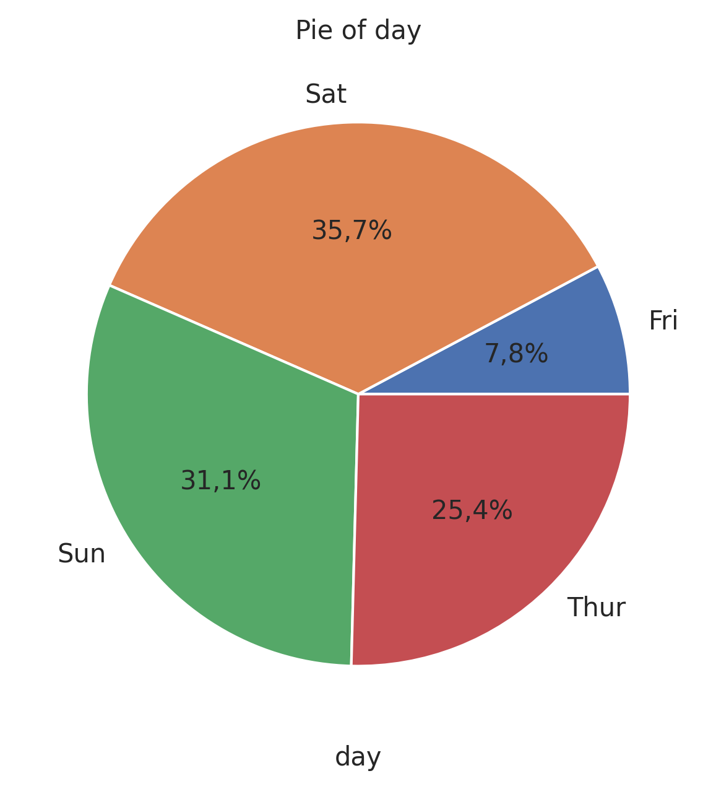
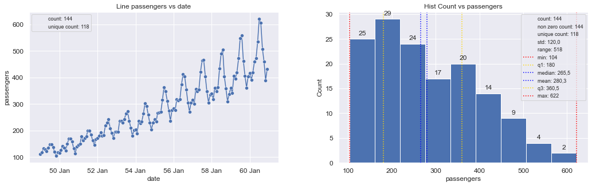

# Summary

`grplot` is an open-source Python library that compresses multi-step statistical
plotting workflows into a single high-level function call. Built on top of
Matplotlib [@Hunter2007], NumPy [@Harris2020], and Pandas [@McKinney2010], and
bundled with a vendored Seaborn fork (`grplot_seaborn`), it exposes a unified
`plot2d` API that automatically
handles subplot creation, axis labeling, legends, statistical annotations, number
formatting, and figure export. Users specify what to plot via a plot-type string
or a dictionary mapping panel positions to plot types; the library applies sensible
defaults while accepting 100+ parameters for explicit overrides at global,
per-axis, or per-element granularity. As of version 1.0.4 (released 2026-02-18),
`grplot` requires Python 3.10+ and is available on PyPI and conda-forge.

# Statement of Need

Producing publication-quality figures in Python typically requires orchestrating
several libraries: constructing Figure/Axes objects in Matplotlib, calling Seaborn
chart functions, manually setting tick formats, adding text annotations, adjusting
legends, and finally saving the output. For practitioners who generate many plots
routinely—data analysts, researchers, and data scientists—this boilerplate is
repetitive and error-prone.

Existing libraries address parts of this problem. Matplotlib [@Hunter2007]
provides full control but involves verbose syntax. Seaborn [@Waskom2021] reduces
setup for common statistical charts. Altair [@VanderPlas2019] and `plotnine`
[@Wickham2016] offer declarative grammars, and Plotly [@Plotly2015] focuses on
interactivity. None of these, however, offers a single call that combines
multi-panel layout, statistical summaries, number formatting, annotation, and file
export for static, reproducible figures.

`grplot` fills this gap with a consistent imperative API. It is particularly
suited to data practitioners who need reproducible, annotated figures in notebooks
or technical reports without rebuilding formatting utilities for each project. It
also ships two domain-specific analytics utilities—cohort retention analysis and
rank-order/gain/KS/lift tables—that practitioners commonly reimplement from
scratch.

# Design and API

## Hierarchical Parameter Model

`plot2d` accepts parameters at three scopes:

- **Global**: applied to all panels (e.g., `figsize`, `fontsize`).
- **Axes-level**: scoped to a panel by 1-based index `"[i]"` (1-D) or
  `"[row,col]"` (2-D grid), e.g., `title={"[2,1]": "My title"}`.
- **Axes-Plot-level**: element-level overrides within a panel, e.g.,
  `hue={"[1,2]": {"scatterplot": "species"}}`.

This hierarchy lets a single call express a complete multi-panel dashboard while
preserving fine-grained per-panel control.

## Core Parameters

| Parameter | Description |
|---|---|
| `plot` | Chart type string or dict mapping `"[row,col]"` to chart type |
| `df` | Input data: Pandas DataFrame, dict of lists, or dict of NumPy arrays |
| `x`, `y` | Column names or arrays for axes variables |
| `Nx`, `Ny` | Grid columns and rows for multi-panel layout |
| `figsize` | Figure dimensions `[width, height]` |
| `pad`, `hpad`, `wpad` | Figure and inter-panel padding |
| `filter` | Per-panel Pandas query string or boolean Series |
| `title` | Panel or global title |
| `fontsize`, `tick_fontsize`, `legend_fontsize`, `label_fontsize`, `title_fontsize` | Font size controls |
| `legend_loc` | Legend location |
| `sep`, `xsep`, `ysep` | Thousands/decimal number formatting |
| `lim`, `xlim`, `ylim` | Axis limits |
| `log`, `xlog`, `ylog` | Log-scale axis |
| `dt`, `xdt`, `ydt` | Datetime tick format strings |
| `rot`, `xrot`, `yrot` | Tick label rotation |
| `statdesc`, `xstatdesc`, `ystatdesc` | Statistical summary annotation |
| `text`, `xtext`, `ytext` | Value-label text annotations |
| `label_add`, `tick_add`, `statdesc_add` | Text concatenation onto labels/ticks |
| `saveas` | Export path and format |
| `optimizer` | Data pre-processing mode |

## Supported Chart Types

| Family | Chart types |
|---|---|
| Relational | `scatterplot`, `lineplot` |
| Distribution | `histplot`, `kdeplot`, `ecdfplot`, `rugplot` |
| Categorical | `stripplot`, `swarmplot`, `boxplot`, `violinplot`, `boxenplot`, `pointplot`, `barplot`, `countplot` |
| Specialized | `pieplot`, `treemapsplot`, `packedbubblesplot`, `paretoplot` |
| Regression | `regplot`, `residplot` |

Any two chart types may be overlaid on the same axis using `+` notation
(e.g., `"histplot+kdeplot"`, `"lineplot+scatterplot"`). Five composites carry
pre-tuned default values: `boxplot+stripplot`, `violinplot+stripplot`,
`boxplot+swarmplot`, `violinplot+swarmplot`, and `stripplot+pointplot`.
Multiple panels can be composed into grid dashboards using the `Nx` (columns)
and `Ny` (rows) parameters.

## Analytic Utilities

`grplot.analytic.cohort` produces a cohort retention heatmap from a customer
transaction table, computing monthly retention rates and an optional summary row
in a single call.

`grplot.analytic.rank_order` generates a rank-order table with gain, KS statistic,
and lift curves from predicted probabilities and true binary labels, supporting
multi-class outputs via a class selector.

# Usage Examples

## Scatter Plot

```python
from grplot import plot2d
import grplot_seaborn as gs

gs.set_theme(context='notebook', style='darkgrid', palette='deep')
tips = gs.load_dataset('tips')

ax = plot2d(
    plot='scatterplot',
    df=tips.head(5),
    x='tip',
    y='total_bill',
    sep='.c',
    tick_add='Rp(_)',
    text=True,
    title='total_bill vs tip'
)
```



## Histogram with Statistical Summary

```python
from grplot import plot2d
import grplot_seaborn as gs

gs.set_theme(context='notebook', style='darkgrid', palette='deep')
tips = gs.load_dataset('tips')

ax = plot2d(
    plot='histplot',
    df=tips,
    x='total_bill',
    hue='sex',
    xsep='.c',
    ysep='.',
    statdesc={'total_bill': 'general'},
    xtick_add='Rp(_)',
    ytext='h',
    title='Histogram Count vs total_bill',
    multiple='stack',
    kde=True,
    alpha=0.75
)
```



## Pareto Plot

```python
from grplot import plot2d
import grplot_seaborn as gs

gs.set_theme(context='notebook', style='darkgrid', palette='deep')
tips = gs.load_dataset('tips')

ax = plot2d(
    plot='paretoplot',
    df=tips,
    x='day',
    y='total_bill',
    sep='.c',
    ytick_add='Rp(_)',
    ytext='h+i',
    title='Pareto total_bill vs day'
)
```



## Pie Plot

```python
from grplot import plot2d
import grplot_seaborn as gs

gs.set_theme(context='notebook', style='darkgrid', palette='deep')
tips = gs.load_dataset('tips')

ax = plot2d(
    plot='pieplot',
    df=tips,
    x='day',
    sep='.',
    text=True,
    title='Pie of day'
)
```



## Dashboard Row Layout (1-D Multi-Panel)

```python
from grplot import plot2d
import grplot_seaborn as gs
import pandas as pd

gs.set_theme(context='notebook', style='darkgrid', palette='deep')
flights = gs.load_dataset('flights')
flights = flights.replace(
    {'month': dict(zip(pd.unique(flights['month']).tolist(), range(1, 13)))}
)
flights['date'] = pd.to_datetime(flights[['year', 'month']].assign(DAY=1))
flights = flights.drop(labels=['year', 'month'], axis=1)

ax = plot2d(
    plot={'[1]': 'lineplot+scatterplot', '[2]': 'histplot'},
    Nx=2, Ny=1,
    df=flights,
    x=['date', 'passengers'],
    y=['passengers', None],
    figsize=[16, 6],
    fontsize=12,
    legend_fontsize=9,
    sep={'passengers': '.', 'year': None},
    xdt={'[1]': '%y %b'},
    ytext={'[2]': 'h'},
    statdesc={'[1]': {'passengers': 'count+unique'},
              '[2]': {'passengers': 'general'}},
    title={'[1]': 'Line passengers vs date',
           '[2]': 'Hist Count vs passengers'}
)
```



## Dashboard Grid Layout (2-D Multi-Panel)

```python
from grplot import plot2d
import grplot_seaborn as gs

gs.set_theme(context='notebook', style='darkgrid', palette='deep')
tips = gs.load_dataset('tips')

ax = plot2d(
    plot={
        '[1,1]': 'histplot',    '[1,2]': 'ecdfplot',
        '[2,1]': 'treemapsplot','[2,2]': 'pieplot',
        '[3,1]': 'paretoplot',  '[3,2]': 'boxplot+stripplot'
    },
    Nx=2, Ny=3,
    df=tips,
    filter=(tips['total_bill'] > 10),
    x=['total_bill', 'total_bill', 'day', 'day', 'day', 'total_bill'],
    y=[None, None, None, None, 'total_bill', 'day'],
    hpad=6, wpad=8,
    figsize=[16, 16],
    fontsize=12,
    legend_fontsize=9,
    sep={'total_bill': '.c',
         '.': ['Count', 'Proportion', '[2,1]', '[2,2]', 'Cumulative Percentage']},
    statdesc={'[1,1]': {'total_bill': 'general'},
              '[3,2]': {'total_bill': 'boxplot'}},
    text={'Count': 'h', True: ['[2,1]', '[2,2]'],
          '[3,1]': {'total_bill': 'h+i'}},
    tick_add={'total_bill': 'Rp(_)'},
    title={
        '[1,1]': 'Histogram Count vs total_bill',
        '[1,2]': 'ECDF Proportion vs total_bill',
        '[2,1]': 'Treemaps of day',
        '[2,2]': 'Pie of day',
        '[3,1]': 'Pareto total_bill vs day',
        '[3,2]': 'Box day vs total_bill'
    },
    alpha={'[1,1]': 0.75},
    kde=True
)
```


## Cohort Retention Analysis

```python
from grplot.analytic import cohort
import pandas as pd

df = pd.read_csv(
    'https://github.com/ghiffaryr/grplot_data/raw/main/retail_raw_reduced.csv',
    parse_dates=['order_date']
)
df['last_active_date'] = df.groupby('customer_id')['order_date'].transform('max')

ax = cohort(
    df=df,
    customer_id='customer_id',
    signup_date='order_date',
    last_active_date='last_active_date',
    figsize=[16, 12],
    fontsize=16,
    sep='.',
    display_summary=True
)
```


# Acknowledgements

The author thanks the maintainers of Matplotlib, Seaborn [@Waskom2021], NumPy,
Pandas, and IPython [@Perez2007] for providing the foundational infrastructure on
which `grplot` is built. No financial support was received for this work.

## Conflict of Interest

The author declares no conflicts of interest.

## AI Usage Disclosure

GPT-4o was used to assist with copy-editing and grammar review of this paper. All
technical content, design decisions, code, and final text were authored, reviewed,
and validated by the human author.

# References
